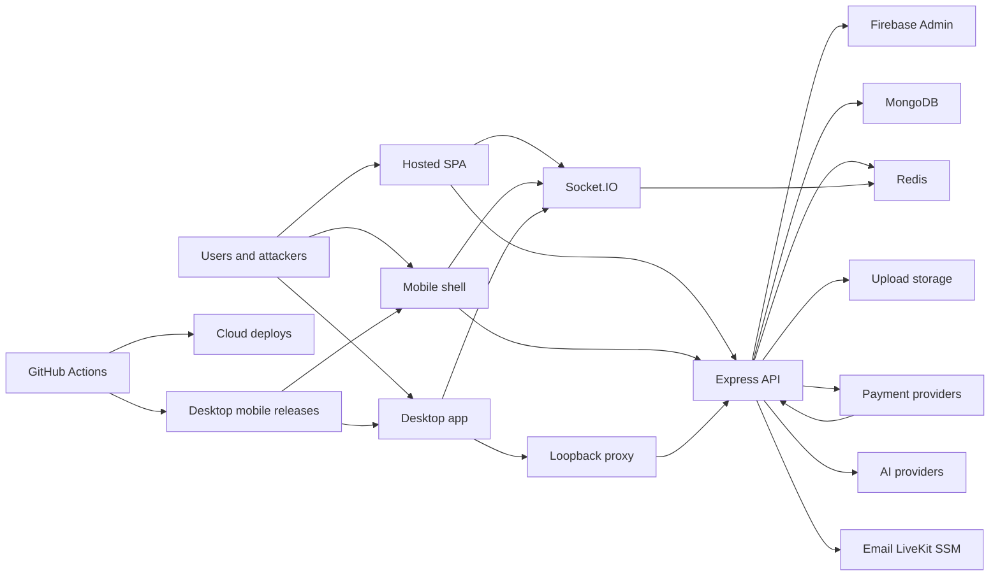

# Security Threat Model - Aura Marketplace

Generated: 2026-05-04

Basis: current working tree at `C:\Users\mdsai\Downloads\Kimi_Agent_Flipkart-Style Frontend`, including uncommitted hardening changes visible in `git status`.

## Executive summary
Aura Marketplace is an internet-facing commerce system, not just a static frontend. The meaningful risk sits at the boundaries between the React/Vite storefront, the Express API, Firebase identity, MongoDB order/payment state, Redis-backed security controls, review-media storage, AI/provider calls, and GitHub-driven release channels for web, desktop, mobile, and EC2 deployment. The strongest existing controls are concentrated in auth, CSRF, rate limiting, payment idempotency, signed uploads, production hardening audits, and release signing gates; the highest residual risks are custom auth/admin complexity, payment/order integrity, AI/tool cost abuse, single-host EC2 availability, operational endpoint exposure, and supply-chain/release compromise.

## Scope and assumptions
In scope:
- `app/`: React/Vite storefront, Capacitor mobile shell source, CSP and static hosting configs.
- `server/`: Express API, workers, middleware, routes, services, validators, Docker image, tests, and production hardening scripts.
- `desktop/`: Electron wrapper, local runtime proxy, auto-update behavior.
- `.github/workflows/`: CI, deploy, desktop release, mobile release, and production orchestration.
- `infra/aws/`: EC2/Caddy/Redis runtime compose, deployment scripts, Parameter Store sync.
- `docs/`: architecture and deployment documentation where it affects operator behavior.

Out of scope:
- Live AWS, Vercel, Netlify, GitHub, Firebase, Stripe, Razorpay, LiveKit, OpenAI, Google, Gmail, and store-console configuration not represented in this repository.
- Secret values, git history rewrite, provider-side fraud controls, third-party platform internals, and production network telemetry.
- Penetration-test validation of live endpoints. This is a repo-grounded threat model, not an exploit report.

Assumptions:
- The production model is public storefront hosts plus a long-lived Express backend on AWS EC2 split runtime. Evidence: `README.md`, `docs/aws-backend-deployment.md`, `infra/aws/docker-compose.ec2.yml`.
- Firebase ID tokens and server-side MongoDB user records jointly determine user identity and admin access. Evidence: `app/src/config/firebase.js`, `server/middleware/authMiddleware.js`.
- Redis is a security dependency for CSRF, rate limits, realtime coordination, and worker coordination. Evidence: `server/middleware/csrfMiddleware.js`, `server/middleware/distributedRateLimit.js`, `docs/system-architecture.md`.
- Payment providers, AI providers, email providers, S3, LiveKit, and Firebase Admin are privileged external trust boundaries. Evidence: `server/package.json`, `server/routes/paymentRoutes.js`, `server/routes/aiRoutes.js`, `server/services/reviewMediaStorageService.js`.
- The threat model treats stale or conflicting documentation as risk because average maintainers will follow docs under pressure.

Open questions that would materially change risk ranking:
- Is the current EC2 compose stack only a low-cost bootstrap, or is it the intended long-term production topology?
- Are GitHub branch protections, environment approvals, release approvals, and cloud role trust policies enforced outside this repo?
- Are Firebase Auth authorized domains, Firestore/Storage rules, OAuth provider restrictions, and mobile app SHA fingerprints locked down in the Firebase console?
- Are payment provider webhook endpoints configured with provider-side retries, replay windows, and strict secret rotation?

## System model
### Primary components
- Hosted storefront: React 19 + Vite 7 SPA served by Vercel, Netlify, and AWS S3/CloudFront paths. Evidence: `app/package.json`, `README.md`, `app/vercel.json`, `netlify.toml`.
- Mobile shell: Capacitor Android/iOS wrappers loading the hosted storefront, with native auth features opt-in. Evidence: `app/package.json`, `docs/mobile-app-delivery.md`, `app/android/app/build.gradle`.
- Desktop shell: Electron wrapper packaging the built frontend, running a loopback runtime proxy, and using GitHub release metadata for auto-update. Evidence: `package.json`, `desktop/main.cjs`, `desktop/runtimeServer.cjs`, `docs/desktop-app.md`.
- Backend API: Express 5 server with Helmet, CORS, JSON parsers, request timeout, metrics middleware, Mongo sanitization, XSS sanitizer, distributed rate limits, REST routes, health, metrics, uploads, and Socket.IO. Evidence: `server/index.js`.
- Worker runtime: separate Node worker process for email/payment/catalog/reconciliation style work in split runtime. Evidence: `server/package.json`, `infra/aws/docker-compose.ec2.yml`, `docs/system-architecture.md`.
- Data stores: MongoDB for durable domain state, Redis for security counters/tokens/realtime/worker coordination, S3 or local volume for review media. Evidence: `docker-compose.split-runtime.yml`, `infra/aws/docker-compose.ec2.yml`, `server/services/reviewMediaStorageService.js`.
- External services: Firebase Admin/Auth, Stripe/Razorpay, email providers, AI providers, LiveKit, AWS S3/SSM/S3 release bucket. Evidence: `server/package.json`, `server/routes/paymentRoutes.js`, `server/routes/aiRoutes.js`, `.github/workflows/deploy-backend-aws.yml`.
- CI/release: GitHub Actions validates, builds, deploys EC2 backend through SSM, deploys frontend artifacts, signs/publishes desktop and mobile artifacts. Evidence: `.github/workflows/ci.yml`, `.github/workflows/deploy-backend-aws.yml`, `.github/workflows/desktop-release.yml`, `.github/workflows/mobile-release.yml`.

### Data flows and trust boundaries
- Internet user -> storefront host.
  Data: public JS/CSS/assets, Firebase public config, user input, browser storage state.
  Channel: HTTPS static hosting.
  Guarantees: CSP, browser sandbox, React escaping by default.
  Validation: mostly client-side request shaping; authoritative validation must happen server-side. Evidence: `app/index.html`, `app/src/services/apiBase.js`.

- Browser/mobile/desktop -> Express API.
  Data: Firebase bearer tokens, cookies/session identifiers, CSRF tokens, JSON payloads, diagnostics, uploads, order/payment operations.
  Channel: HTTPS via same-origin rewrites/proxies, or Electron loopback proxy to hosted backend.
  Guarantees: CORS allowlist, Helmet, body limits, request timeouts, distributed rate limits, auth middleware, validators.
  Validation: route validators and middleware. Evidence: `server/index.js`, `server/config/corsFlags.js`, `server/middleware/authMiddleware.js`, `server/middleware/csrfMiddleware.js`, `server/middleware/validate.js`.

- Browser/mobile/desktop -> Socket.IO.
  Data: Firebase bearer token, realtime events, presence/support/video state.
  Channel: WebSocket/Socket.IO.
  Guarantees: origin allowlist, Firebase token verification, Redis adapter for split runtime.
  Validation: socket handshake middleware and room/event controls. Evidence: `server/services/socketService.js`.

- Express API -> Firebase Admin.
  Data: bearer tokens, Firebase user records, revocation checks.
  Channel: Firebase Admin SDK outbound calls.
  Guarantees: provider token verification and revocation checks.
  Validation: `verifyIdToken(token, true)` and backend user lookup. Evidence: `server/middleware/authMiddleware.js:809`.

- Express API -> MongoDB.
  Data: users, roles, products, carts, orders, payment intents, AI threads, diagnostics, emails, catalog jobs.
  Channel: MongoDB driver/Mongoose.
  Guarantees: server-only access assumed; route-level authz required.
  Validation: Mongoose schemas, zod validators, service-level owner checks and transactions. Evidence: `server/routes/orderRoutes.js`, `server/routes/paymentRoutes.js`, `server/services/orderPlacementService.js`.

- Express API -> Redis.
  Data: CSRF tokens, upload-token nonces, rate-limit counters, caches, queues/backplane.
  Channel: Redis driver.
  Guarantees: internal container network assumed; Redis required for security-critical controls.
  Validation: fail-closed paths exist for CSRF and required rate limiting. Evidence: `server/middleware/csrfMiddleware.js`, `server/middleware/distributedRateLimit.js`.

- Express API -> payment providers.
  Data: payment intents, provider order ids, webhook payloads, refunds, settlement data.
  Channel: provider SDK/HTTPS and public webhook callbacks.
  Guarantees: authenticated user routes plus provider signature verification expected in payment services.
  Validation: OTP assurance, active-account checks, idempotency, amount/currency matching, provider event processing. Evidence: `server/routes/paymentRoutes.js`, `server/services/payments/paymentService.js`.

- Payment provider -> webhook routes.
  Data: signed payment lifecycle events.
  Channel: public HTTPS POST to `/api/payments/webhooks/*`.
  Guarantees: must depend on provider signature/replay validation because routes are public.
  Validation: controller/service webhook handlers. Evidence: `server/routes/paymentRoutes.js:32`, `server/routes/paymentRoutes.js:33`, `server/controllers/paymentController.js`.

- Express API -> upload storage -> public media read.
  Data: user review media, MIME type, object key, content length.
  Channel: local volume or S3 SDK, then public `/uploads/reviews/*` reads.
  Guarantees: signed one-time upload tokens, MIME allowlist, path checks, size caps, cache headers.
  Validation: upload validators, token nonce consumption, safe asset path checks. Evidence: `server/routes/uploadRoutes.js`, `server/controllers/uploadController.js`, `server/controllers/uploadAssetController.js`, `server/services/uploadSignatureService.js`.

- Express API -> AI providers and assistant tools.
  Data: prompts, session history, product-search context, tool actions, cost/latency telemetry.
  Channel: HTTPS to model/provider APIs; SSE for streaming responses to clients.
  Guarantees: route rate limits, optional/private access mode, quota checks, tool registry validation.
  Validation: `aiValidators`, chat quota, registered assistant tools. Evidence: `server/routes/aiRoutes.js`, `server/services/ai/assistantToolRegistry.js`, `server/services/chatQuotaService.js`.

- External schedulers/internal clients -> internal operations.
  Data: cron triggers, internal AI prompts.
  Channel: HTTPS with bearer secrets or signed internal AI tokens.
  Guarantees: fail-closed secret/token auth when configured.
  Validation: `requireInternalJobAuth`, `requireInternalAiAuth`, signed token validation. Evidence: `server/routes/internalOpsRoutes.js`, `server/middleware/internalJobAuth.js`, `server/middleware/internalAiAuth.js`, `server/services/internalAiTokenService.js`.

- GitHub Actions -> AWS/Vercel/Netlify/GitHub Releases.
  Data: source, build artifacts, Docker images, release bundles, signing secrets, deploy roles, SSM commands.
  Channel: GitHub-hosted runners, OIDC, provider CLIs/APIs.
  Guarantees: workflow permissions, OIDC roles, preflight audits, artifact guards, signing gates.
  Validation: CI/hardening scripts and workflow preflight checks. Evidence: `.github/workflows/ci.yml`, `.github/workflows/deploy-backend-aws.yml`, `.github/workflows/desktop-release.yml`, `server/scripts/audit_production_hardening_contract.js`.

#### Diagram

## Assets and security objectives
| Asset | Why it matters | Security objective (C/I/A) |
| --- | --- | --- |
| Firebase ID tokens and browser sessions | Primary proof of user identity and account ownership | C/I |
| CSRF tokens and trusted-device/session step-up state | Protects browser-origin state-changing requests and privileged actions | C/I |
| MongoDB user, role, order, cart, catalog, and payment records | Source of truth for commerce, admin access, and user harm | C/I/A |
| Payment intents, provider ids, refunds, outbox tasks | Integrity-critical money movement and reconciliation state | I/A |
| Admin APIs and role/allowlist configuration | Controls users, products, catalog, payments, ops, analytics | C/I/A |
| Review media and upload tokens | User-generated content served back to browsers from trusted origin | I/A |
| AI prompts, assistant threads, tool audits, provider keys | Contains user context and can create provider-cost or data-leak risk | C/I/A |
| Secrets: Firebase Admin, payment keys, CRON_SECRET, METRICS_SECRET, AI internal secret, S3, LiveKit, email | Direct control over identity, money, internal jobs, telemetry, storage, and external services | C/I |
| Build artifacts: frontend bundles, Docker images, desktop installers, mobile binaries, update metadata | Trusted code distributed to users and production hosts | I/A |
| EC2/Caddy/API/worker/Redis/Mongo/S3 runtime | Availability and integrity of the marketplace | I/A |
| Metrics, logs, diagnostics, health snapshots | Operational insight; also reveals topology and failure modes | C/A |

## Attacker model
### Capabilities
- Remote unauthenticated attacker can send arbitrary HTTP requests to public API, health, metrics, upload read, webhook, Socket.IO handshake, and diagnostics routes.
- Authenticated user can obtain a valid Firebase token and exercise all normal user, seller, checkout, upload, AI, and order/refund flows.
- Malicious admin or compromised admin session can access high-impact admin paths and trigger payment/catalog/user/ops actions.
- Browser-origin attacker can attempt CSRF, XSS payload delivery, malicious uploaded media, open-web redirects, diagnostics flooding, and same-origin token abuse.
- Botnet or commodity attacker can create volumetric pressure on API, AI routes, uploads, auth/OTP, health, and websocket handshakes.
- Supply-chain attacker can target GitHub workflows, npm dependencies, release artifacts, signing material, updater metadata, SSM deploy commands, or cloud deploy roles.
- Provider-side attacker or misconfiguration can send malformed or replayed webhooks and callbacks.

### Non-capabilities
- No direct MongoDB or Redis network access is evidenced for normal production traffic.
- No private Firebase Admin credentials are intentionally present in browser bundles; frontend Firebase API keys are public configuration, not server secrets.
- No assumption of shell access to the EC2 host, GitHub runner, developer machine, or cloud console unless the threat is explicitly supply-chain/operator compromise.
- No assumption that public users can directly call privileged admin routes without a valid authenticated identity.
- No assumption that payment card PANs are stored in this repo; payment provider references and order/payment state are the modeled assets.

## Entry points and attack surfaces
| Surface | How reached | Trust boundary | Notes | Evidence (repo path / symbol) |
| --- | --- | --- | --- | --- |
| Hosted storefront | Public HTTPS to Vercel/Netlify/S3/CloudFront | Internet -> browser runtime | Delivers app code and CSP; broad `connect-src https: wss:` increases XSS exfiltration latitude | `app/index.html`, `app/vercel.json`, `netlify.toml` |
| Electron desktop app | Installed binary, local runtime proxy, GitHub updater | User device -> local proxy -> backend | Update channel and local proxy become trusted code paths | `desktop/main.cjs`, `desktop/runtimeServer.cjs` |
| Capacitor mobile shell | Installed APK/IPA loading hosted storefront | User device -> hosted app/backend | Release signing and hosted web integrity matter | `docs/mobile-app-delivery.md`, `app/android/app/build.gradle` |
| API route stack | `/api/*` through edge/proxy | Internet -> Express | Main business surface | `server/index.js:364` to `server/index.js:394` |
| Auth/session/OTP | `/api/auth`, `/api/otp` | Browser identity -> backend identity | Custom session, CSRF, OTP, trusted-device complexity | `server/routes/authRoutes.js`, `server/middleware/authMiddleware.js` |
| Admin APIs | `/api/admin/*` | Authenticated user -> privileged control plane | High-impact changes to users, products, payments, ops | `server/routes/adminPaymentRoutes.js`, `server/routes/adminUserRoutes.js`, `server/routes/adminOpsRoutes.js` |
| Orders and checkout | `/api/orders`, `/api/checkout` | User input -> money/order state | Requires server-authoritative pricing and ownership checks | `server/routes/orderRoutes.js`, `server/services/orderPlacementService.js` |
| Payment APIs | `/api/payments/*` | User/payment provider -> payment state | OTP assurance, idempotency, provider signature validation are critical | `server/routes/paymentRoutes.js`, `server/services/payments/paymentService.js` |
| Payment webhooks | `/api/payments/webhooks/razorpay`, `/stripe` | Provider internet callback -> backend | Public unauthenticated route must prove provider origin/signature | `server/routes/paymentRoutes.js:32` |
| Upload signing/upload | `/api/uploads/reviews/sign`, `/upload` | Authenticated user -> storage | Signed one-time token and MIME/size checks | `server/routes/uploadRoutes.js`, `server/controllers/uploadController.js` |
| Upload reads | `/uploads/reviews/*`, `/uploads/*` | Internet -> stored user content | Trusted-origin media serving and path safety | `server/index.js:340`, `server/controllers/uploadAssetController.js` |
| Socket.IO | `/socket.io` WebSocket upgrade | Browser/device -> realtime server | Firebase token and origin checks gate realtime actions | `server/services/socketService.js` |
| AI assistant | `/api/ai/*`, `/api/internal/ai/*` | User/internal client -> model/tool providers | Prompt injection, spend, data retention, tool-action risk | `server/routes/aiRoutes.js`, `server/routes/internalOpsRoutes.js` |
| Internal cron | `/api/internal/cron/*` | Scheduler -> backend jobs | Bearer secret protects operational jobs | `server/routes/internalOpsRoutes.js`, `server/middleware/internalJobAuth.js` |
| Health endpoints | `/health/live`, `/health`, `/health/ready` | Internet/edge -> runtime status | Production `/health` uses a public summary unless the health token is presented; production readiness fails closed without `HEALTH_READY_TOKEN` | `server/index.js:250`, `server/index.js:397`, `server/index.js:450` |
| Metrics endpoint | `/metrics` | Scraper -> Prometheus metrics | Header secret or fail-closed config | `server/routes/metricsRoute.js`, `server/middleware/metrics.js` |
| Client diagnostics | `/api/observability/client-diagnostics` | Browser/anonymous -> logs/diagnostics store | Anonymous by design; rate-limited and zod-validated | `server/routes/observabilityRoutes.js`, `server/controllers/observabilityController.js` |
| AWS backend deploy | GitHub Actions -> S3/SSM/EC2 | CI -> production runtime | OIDC, S3 release bundle, SSM command trust | `.github/workflows/deploy-backend-aws.yml` |
| Desktop/mobile releases | GitHub Actions -> GitHub Releases/stores | CI -> user devices | Signing and latest-channel integrity are crown jewels | `.github/workflows/desktop-release.yml`, `.github/workflows/mobile-release.yml` |

## Top abuse paths
1. Account takeover to privileged action: attacker compromises a user session, looks for stale backend role/cache behavior or weak step-up paths, reaches admin or payment-sensitive APIs, then mutates users, refunds, products, catalog, or ops state.
2. CSRF/session confusion: attacker induces browser-origin writes against cookie/session-backed endpoints, attempts to replay or cross-bind CSRF tokens, then changes account/payment/order state. Current Redis one-time token and header-only requirements are the main barrier.
3. Payment/order integrity attack: authenticated attacker creates or reuses a payment intent, tampers with amount/currency/order linkage, races order placement or refund requests, and attempts to receive an order/refund without valid provider settlement.
4. Webhook spoof/replay: attacker posts forged provider events to public webhook routes, tries to mark intents paid/refunded, and causes outbox/reconciliation work to accept false provider state.
5. Upload/media abuse: attacker obtains an upload token, submits mislabeled media or path-confusion content, then serves active or abusive content from trusted `/uploads` origin or consumes local/S3 storage.
6. AI/provider abuse: attacker sends high-volume or prompt-injected assistant requests, induces expensive model calls/tool lookups, stores sensitive conversation context, or attempts to make assistant actions appear trustworthy without user confirmation.
7. Internal job/token abuse: attacker obtains `CRON_SECRET`, `AI_INTERNAL_AUTH_SECRET`, or a legacy internal AI secret, triggers maintenance jobs or internal AI calls, and causes data mutation, provider spend, or operational noise.
8. Operational reconnaissance and flooding: attacker scrapes `/health`, probes `/health/ready`, attacks `/metrics`, floods diagnostics, and uses topology/failure detail to time attacks or degrade visibility.
9. Single-host availability attack: attacker or normal growth saturates the EC2 host, local Redis, API worker, upload volume, or provider quota, bringing down both user traffic and background reconciliation.
10. Release-channel compromise: attacker compromises GitHub workflow, signing secret, release token, npm dependency, or SSM deploy command, then ships malicious web/desktop/mobile/server artifacts to production or user devices.

## Threat model table
| Threat ID | Threat source | Prerequisites | Threat action | Impact | Impacted assets | Existing controls (evidence) | Gaps | Recommended mitigations | Detection ideas | Likelihood | Impact severity | Priority |
| --- | --- | --- | --- | --- | --- | --- | --- | --- | --- | --- | --- | --- |
| TM-001 | Authenticated attacker or stolen-session attacker | Valid Firebase token, stolen browser session, or compromised user credentials. Admin impact requires role/session weakness. | Abuse custom auth/session/admin paths to bypass freshness, allowlist, 2FA/passkey, or active-account checks. | Unauthorized account/admin actions, user data exposure, refunds/catalog/user mutation. | Firebase identity, browser sessions, admin state, user/payment/order data | Firebase revocation checks in `authMiddleware.js:809`; admin policy flags in `authMiddleware.js:191`; admin middleware starts at `authMiddleware.js:1003`; admin routes use `protect, admin`. | Auth middleware is very large and custom; average maintainers can regress ordering, cache freshness, or route protection. | Keep admin routes behind shared `protect, admin`; require production 2FA/passkey/allowlist; add route inventory tests that fail if `/api/admin/*` lacks admin; keep auth middleware decomposition on the roadmap. | Alert on admin denials, stale-session blocks, admin role changes, new admin route registrations, and impossible travel/device changes. | Medium | High | high |
| TM-002 | Browser-origin attacker | Victim has cookie/session auth or a browser-accessible token; attacker can cause cross-site or injected requests. | Replay or cross-bind CSRF tokens, bypass token transport rules, or exploit bearer-vs-cookie path confusion. | State-changing account/order/payment writes as victim. | CSRF tokens, sessions, account/order state | Redis token storage and one-time consumption in `csrfMiddleware.js:92` and `csrfMiddleware.js:192`; header-only token enforcement in `csrfMiddleware.js:227`; client token reservation in `app/src/services/csrfTokenManager.js`. | Some auth flows intentionally bypass CSRF for bearer auth; complexity around OAuth/session sync is easy to misapply. | Maintain explicit route tests for state-changing cookie-backed endpoints; keep CSRF tokens header-only; document bearer-only exceptions next to routes. | Track `csrf.token_missing`, `csrf.token_transport_rejected`, `csrf.principal_mismatch`, and spikes by route/origin. | Medium | High | high |
| TM-003 | Authenticated malicious buyer/seller | Valid user account and access to checkout/payment/order APIs. | Tamper amount/currency, replay idempotency keys, race payment-intent claim locks, or claim someone else's order/payment state. | Order without payment, refund fraud, inventory corruption, financial reconciliation failure. | Payment intents, orders, inventory, refund ledger | Payment routes require `protect`, active account, OTP assurance at `paymentRoutes.js:35`; idempotency service referenced in `paymentController.js`; pricing/settlement validation and active-intent caps in `paymentService.js`; order routes validate and protect writes. | Large payment service has many provider and currency branches; correctness depends on transaction availability and consistent idempotency use at every mutation. | Keep transaction-required tests for digital payment order placement; require idempotency keys for every retryable money mutation; audit owner checks around every intent/order lookup. | Alert on amount/currency mismatches, repeated idempotency conflicts, stale claim locks, refund ledger edits, and order-without-captured-intent states. | Medium | High | high |
| TM-004 | Remote webhook attacker | Public webhook route reachable; attacker can guess provider event shape or replay old events. | Forge or replay Stripe/Razorpay webhook events to mark intents paid/refunded or trigger outbox side effects. | False payment state, fraudulent orders/refunds, reconciliation drift. | Payment events, intents, refunds, outbox tasks | Public routes are isolated at `paymentRoutes.js:32` and `paymentRoutes.js:33`; controller delegates to provider processors in `paymentController.js`. | Signature/replay validation is not visible at the route boundary and depends on deeper service correctness and raw-body handling. | Keep provider signature verification tests at webhook boundary; reject stale event timestamps; store processed provider event ids with uniqueness. | Alert on invalid signature attempts, duplicate provider event ids, webhook events for unknown intents, and out-of-order status transitions. | Medium | High | high |
| TM-005 | Authenticated malicious user | Valid account and review-upload access. | Upload mislabeled, oversized, active, or path-confusing content, then serve it from trusted `/uploads` origin or exhaust storage. | Stored active content, trusted-origin content confusion, storage cost/DoS. | Review media, upload storage, trusted origin, user devices | Signed routes in `uploadRoutes.js`; MIME and size checks in `uploadController.js:52` and `uploadController.js:136`; one-time token nonce in `uploadSignatureService.js:105`; safe read path in `uploadAssetController.js:16`; upload read limiter in `server/index.js:215`. | MIME checks are based on declared/data URL type, not deep content scanning; local volume storage can fill the EC2 host if S3 is not used. | Use S3 in production, scan media asynchronously, serve uploads from isolated media domain when feasible, cap per-user storage and upload rate. | Monitor upload failures, MIME mismatches, storage growth, per-user upload volume, and 404/400 bursts on `/uploads`. | Medium | Medium | medium |
| TM-006 | Authenticated user, public AI user if enabled, or internal AI client | AI routes reachable; model provider keys configured; quota/rate controls imperfect. | Prompt-inject assistant, induce expensive calls, persist sensitive conversation data, or abuse tool-action outputs as trusted business actions. | Provider spend, data leakage, misleading commerce actions, model-induced policy bypass attempts. | AI provider keys, assistant threads, product data, user context, cost budgets | AI route limiters in `aiRoutes.js:44`; private quota check in `aiController.js:35`; tool registry validation in `assistantToolRegistry.js:172`; AI observability metrics in `assistantObservabilityService.js`. | Public AI mode exists behind config; tool validation is custom and not a full sandbox; cost controls depend on quotas and provider limits. | Keep public AI off for production unless cost caps are enforced; require confirmation for mutating assistant actions; redact sensitive context before persistence/provider calls. | Alert on assistant cost, fallback, tool validation failures, unusually long prompts, streaming errors, and per-user quota exhaustion. | Medium | High | high |
| TM-007 | Attacker with internal secret, misconfigured scheduler, or SSRF-like pivot | Access to `CRON_SECRET`, `AI_INTERNAL_AUTH_SECRET`, legacy AI secret, or an internal route from a trusted network path. | Trigger cron maintenance or internal AI chat/stream routes outside intended scheduler/service context. | Unauthorized maintenance actions, provider spend, data mutation, queue/reconciliation disturbance. | Internal job surface, AI internal surface, payment/email/catalog maintenance | `requireInternalJobAuth` fail-closed when `CRON_SECRET` missing in `internalJobAuth.js:16`; signed internal AI token support in `internalAiTokenService.js`; production legacy AI shared-secret fallback defaults off unless explicitly enabled; internal routes in `internalOpsRoutes.js`. | Internet exposure of `/api/internal/*` relies entirely on bearer secrecy unless edge/IP/WAF policy blocks it. | Use distinct secrets per internal surface; keep legacy internal AI fallback disabled in production; restrict internal routes at edge/IP/WAF where possible. | Alert on `internal_job_auth.rejected`, `internal_ai_auth.rejected`, internal route calls from unusual IPs, and cron frequency anomalies. | Low | High | medium |
| TM-008 | Remote unauthenticated attacker | Health/diagnostics/metrics routes reachable. | Scrape health topology, probe readiness token behavior, attack metrics auth, or flood anonymous diagnostics. | Reconnaissance, degraded observability, log/cost amplification. | Metrics, health snapshots, diagnostics, operator attention | Metrics auth fail-closed/header-only in `metrics.js:105`; diagnostics limiter in `observabilityRoutes.js:11`; diagnostics schema in `observabilityController.js:35`; readiness token gate in `server/index.js:176`; health-ready limiter in `server/index.js:224`; production `/health` returns reduced public payload unless health token is valid; production `/health/ready` fails closed without `HEALTH_READY_TOKEN`. | `/health/live` is intentionally before heavy middleware; diagnostics accepts anonymous payloads by design. | Retain diagnostics caps/redaction and keep deploy probes aligned with public summary vs private readiness semantics. | Alert on health scrape rates, metrics 401/503, diagnostics limiter hits, and spikes in invalid diagnostic payloads. | Medium | Medium | medium |
| TM-009 | Botnet, traffic spike, provider outage, or single-host failure | Production remains on one EC2 host with local Redis/volumes and shared API/worker dependencies. | Saturate API, Redis, Caddy, disk, worker queues, upload volume, Mongo connectivity, or provider quotas. | Full or partial marketplace outage; stuck payments/email/reconciliation; degraded checkout. | Availability of API, worker, Redis, Mongo, S3/uploads, providers | API/worker split and Caddy edge in `infra/aws/docker-compose.ec2.yml`; request timeout in `server/index.js:265`; Redis-required fail-closed rate limiting in `distributedRateLimit.js`; readiness fail-closed in `healthReadinessService.js`. | No repo-visible ALB/autoscaling/managed Redis/WAF/load shedding/IaC for multi-instance production; local Redis is a single point of failure. | Treat EC2 compose as bootstrap; move Redis/Mongo to managed HA services; add WAF/edge throttles and queue/backpressure alerts before traffic growth. | Alert on Redis health, worker gaps, queue lag, process memory, disk usage, event loop lag, 5xx, and readiness failures. | Medium | High | high |
| TM-010 | Supply-chain attacker or compromised GitHub identity/workflow | Ability to alter workflow/source/dependencies or exfiltrate CI secrets/roles. | Publish malicious frontend, backend image, desktop/mobile release, or deploy through SSM to EC2. | Production compromise, malicious client update, secret theft, cloud account impact. | Build artifacts, signing keys, deploy roles, release metadata, user devices | CI artifact guard and production hardening audit in `.github/workflows/ci.yml`; AWS OIDC deploy permissions in `deploy-backend-aws.yml`; non-root Docker user in `server/Dockerfile:24`; desktop signing preflight in `desktop-release.yml`. | Actual GitHub branch protection/environment approvals are outside repo; deploy workflows still handle powerful secrets/tokens; dependency provenance/SBOM is not fully evidenced. | Enforce required reviews/environments in GitHub; pin actions; produce SBOM/provenance; limit OIDC trust to protected branches/environments; keep release publishing behind successful CI. | Monitor workflow file changes, OIDC role assumption, release asset mutations, SSM command invocations, and dependency lockfile churn. | Medium | Critical | critical |
| TM-011 | Release-channel attacker | GitHub release rights, signing key compromise, updater metadata compromise, or mobile signing misconfiguration. | Ship malicious Electron installer/update or mobile binary that talks to trusted backend and steals tokens/user data. | Client compromise at scale, account takeover, backend abuse through legitimate clients. | Desktop/mobile binaries, signing certs, updater metadata, user sessions | Electron updater configured in `desktop/main.cjs`; Windows signature verification in `desktop-release.yml`; Android release builds fail without private keystore in `app/android/app/build.gradle:28`; mobile workflow refuses unsigned Android publish in `mobile-release.yml`; mobile delivery docs now state there is no repo-public Android update-key fallback. | macOS notarization/GPG checksum signing is less explicit. | Keep all production desktop/mobile releases signed; add checksum/provenance publication; verify updater metadata before marking latest. | Alert on release edits outside workflow, unsigned artifacts, updater errors, unexpected version jumps, and signing-secret access. | Medium | High | high |
| TM-012 | XSS attacker, malicious dependency, or compromised third-party script | Script execution in storefront through dependency, route, markdown, provider script, or future unsafe render path. | Exfiltrate bearer/session/CSRF context, call APIs as user, or connect to arbitrary HTTPS/WSS endpoints allowed by CSP. | Account abuse, data exposure, payment/order actions within victim privileges. | Browser tokens, user data, order/payment APIs | CSP exists in `app/index.html` and hosting configs; React escaping by default; CSRF manager requires tokens for state-changing requests. | CSP `connect-src 'self' https: wss:` is broad; `style-src 'unsafe-inline'` exists; third-party scripts for auth/payment are trusted. | Narrow `connect-src` to known API/Firebase/provider hosts; keep markdown/raw HTML disabled; avoid adding `dangerouslySetInnerHTML`; add CSP report-only telemetry. | Monitor CSP reports, unusual API origins/routes, token refresh anomalies, and sudden client diagnostics from unexpected routes. | Medium | High | high |
| TM-013 | Malicious user or maintainer error | New route added without validator/auth/rate limits; broad middleware exemption copied incorrectly. | Introduce unauthenticated mutation, IDOR, query abuse, body-size bypass, or route-specific DoS. | Data exposure/mutation or availability loss. | All API domain data and controls | Central route registration in `server/index.js`; many routes use `validate` and `protect`; CI runs focused backend security tests. | Route count is high and manual middleware composition is easy to drift; exemptions exist for health, metrics, webhooks, observability, uploads, streaming AI. | Add automated route inventory tests mapping method/path -> auth/validator/rate expectations; fail CI on new public state-changing routes without annotation. | Alert/review on diffs touching `server/routes`, `server/index.js`, middleware exemptions, and validators. | Medium | High | high |
| TM-014 | Dependency attacker or vulnerable package | Malicious/outdated npm package reaches runtime or build. | Execute during install/build/runtime, compromise server/client bundle, or exploit known package vulnerability. | Code execution, data exposure, malicious client/server artifact. | Source, CI runner, server runtime, frontend bundles | `npm audit` scripts across root/app/server; dependency overrides in manifests; CI security gates in `package.json` and `.github/workflows/ci.yml`. | No repo-visible lockfile signature/provenance verification; npm install scripts and transitive dependency trust remain broad. | Use dependency review, provenance/SBOM, Renovate/Dependabot, lockfile-only CI installs, and production dependency audit gates. | Monitor audit deltas, lockfile churn, new postinstall scripts, and unexpected package maintainer/source changes. | Medium | High | high |

## Criticality calibration
For this repository:

- Critical: a path that can compromise production runtime, release artifacts, admin/payment control plane, cloud deploy authority, signing material, or many users at once.
  Examples: GitHub/OIDC workflow compromise that deploys malicious backend; desktop auto-update compromise; unauthenticated admin/payment state takeover.

- High: realistic attacker path that materially affects account integrity, payment/order integrity, provider spend, sensitive user data, or production availability, even if an existing control makes exploitation non-trivial.
  Examples: route-protection regression on admin/payment routes; payment intent/order race; AI cost-abuse path; XSS with broad API access; single-host Redis/API outage.

- Medium: meaningful reconnaissance, abuse, or same-user/same-tenant harm where controls reduce blast radius or exploitation requires configuration mistakes.
  Examples: detailed health scraping; upload storage abuse with MIME/size checks; internal job abuse requiring leaked secret.

- Low: hygiene or latent risk without a concrete attacker path from repo-visible exposure.
  Examples: public Firebase web config by itself; dev-only compose exposure; informational docs gaps that do not change production controls.

## Focus paths for security review
| Path | Why it matters | Related Threat IDs |
| --- | --- | --- |
| `server/index.js` | Central middleware ordering, route registration, body limits, health, metrics, upload reads, and exemptions | TM-008, TM-009, TM-013 |
| `server/middleware/authMiddleware.js` | Core bearer/session/admin/step-up authorization logic and highest regression risk | TM-001, TM-002, TM-013 |
| `server/routes/authRoutes.js` | Session/CSRF/auth sync route behavior | TM-001, TM-002 |
| `server/middleware/csrfMiddleware.js` | CSRF token issuance, one-time use, origin/session binding, transport rules | TM-002 |
| `server/middleware/distributedRateLimit.js` | Redis dependency, fail-closed behavior, security throttling | TM-008, TM-009, TM-013 |
| `server/config/corsFlags.js` | Production origin allowlist and wildcard fail-closed behavior | TM-002, TM-012 |
| `server/routes/paymentRoutes.js` | Payment user routes and public webhook boundary | TM-003, TM-004 |
| `server/controllers/paymentController.js` | Refund/admin/payment orchestration and idempotency entry points | TM-003, TM-004 |
| `server/services/payments/paymentService.js` | Provider, amount/currency, intent, refund, saved-method, and claim-lock logic | TM-003, TM-004 |
| `server/services/payments/idempotencyService.js` | Replay and retry safety for money mutations | TM-003 |
| `server/services/orderPlacementService.js` | Transaction-coupled order/payment/inventory commit path | TM-003, TM-009 |
| `server/routes/orderRoutes.js` | User/admin order, refund, replacement, support, status actions | TM-003, TM-013 |
| `server/routes/uploadRoutes.js` | Upload signing and authenticated media upload entry points | TM-005 |
| `server/controllers/uploadController.js` | MIME, size, token, and storage checks for review media | TM-005 |
| `server/controllers/uploadAssetController.js` | Public trusted-origin media serving and path safety | TM-005 |
| `server/services/uploadSignatureService.js` | HMAC token signature and one-time nonce consumption | TM-005 |
| `server/services/reviewMediaStorageService.js` | Local/S3 storage selection, object keys, public URLs, read behavior | TM-005, TM-009 |
| `server/routes/aiRoutes.js` | Public/private AI access mode, rate limits, streaming endpoints | TM-006 |
| `server/services/ai/assistantToolRegistry.js` | Tool allowlist and action validation against model output | TM-006 |
| `server/services/ai/assistantThreadPersistenceService.js` | Persistence of prompt/session/action data scoped by user/session | TM-006 |
| `server/middleware/internalJobAuth.js` | Secret-based cron authorization | TM-007 |
| `server/middleware/internalAiAuth.js` | Internal AI bearer/signed-token authorization and legacy fallback | TM-007 |
| `server/services/internalAiTokenService.js` | Internal AI token signing, audience, issuer, scope, expiry checks | TM-007 |
| `server/routes/observabilityRoutes.js` | Anonymous diagnostics ingestion and admin diagnostics reads | TM-008 |
| `server/middleware/metrics.js` | Metrics endpoint secret handling and production fail-closed behavior | TM-008 |
| `server/services/healthReadinessService.js` | Readiness fail-closed semantics and boot grace behavior | TM-008, TM-009 |
| `server/services/healthDisclosureService.js` | Public-versus-detailed health disclosure policy | TM-008 |
| `infra/aws/docker-compose.ec2.yml` | Production EC2 topology, Redis sidecar, Caddy edge, volumes | TM-009 |
| `.github/workflows/ci.yml` | Security gates, artifact guard, hardening audit, test coverage | TM-010, TM-014 |
| `.github/workflows/deploy-backend-aws.yml` | OIDC, S3 release bundle, SSM deployment to EC2 | TM-010 |
| `.github/workflows/desktop-release.yml` | Desktop signing, updater metadata, GitHub Release publication | TM-010, TM-011 |
| `.github/workflows/mobile-release.yml` | Mobile signing gates and store/GitHub release publication | TM-010, TM-011 |
| `desktop/main.cjs` | Electron permissions and auto-update behavior | TM-011, TM-012 |
| `desktop/runtimeServer.cjs` | Loopback proxy and backend origin handling | TM-011, TM-012 |
| `app/index.html`, `app/vercel.json`, `netlify.toml`, `vercel.json` | CSP and static hosting security headers | TM-012 |

## Quality check
- Entry points covered: web, mobile, desktop, REST API, Socket.IO, auth/session/OTP, admin, payments/webhooks, orders, uploads, AI, internal cron, health, metrics, diagnostics, CI/deploy, releases.
- Trust boundaries covered: browser/device to API, API to Firebase/Mongo/Redis/providers/storage, provider webhook callbacks, CI to cloud/release channels, local desktop proxy to backend.
- Runtime vs CI/dev separation: runtime threats are TM-001 through TM-009 and TM-012/TM-013; CI/release/dependency threats are TM-010, TM-011, and TM-014.
- Assumptions and open questions are explicitly listed because live cloud/provider configuration was not available from the repository.
- No secrets were read or reproduced. Public Firebase configuration is treated as public config, not as private secret material.
