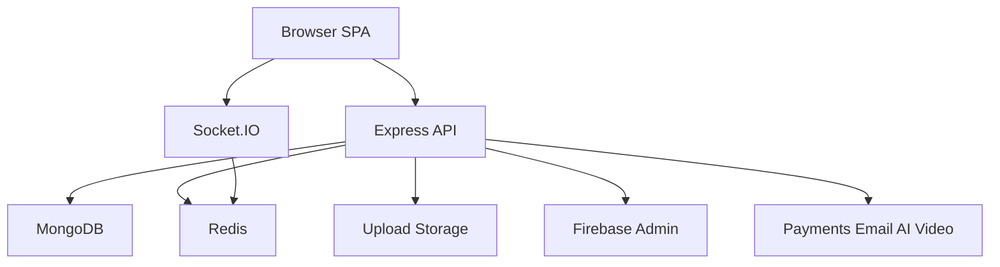

# Security Threat Model

## Executive summary
This repository is not a simple static frontend. It is a browser-delivered React/Vite client backed by an internet-facing Express API, Firebase bearer-token authentication, Redis-backed CSRF and rate limiting, MongoDB persistence, Socket.IO realtime channels, signed review-media uploads, and several third-party integrations for payments, email, AI, and video. The highest-risk themes are request-path abuse around unauthenticated/public surfaces, operational endpoint exposure, and dependency-chain risk in backend auth/email libraries. In this remediation pass, the most direct exploit paths were reduced by removing spoofable global rate-limit keying, failing closed on misconfigured metrics auth while banning query-string secrets, and rate-limiting anonymous diagnostics ingestion.

## Scope and assumptions
- In scope: `app/`, `server/`, the runtime request path between browser and API, and the repo-visible integrations and middleware.
- Out of scope: infrastructure not expressed in the repo, CDN/WAF policies, TLS termination, cloud IAM, secret rotation workflow, and git history rewriting.
- Assumption: this is an internet-exposed web app with a public browser client and a public API.
- Assumption: Firebase ID tokens are the primary auth proof for browser-to-API and browser-to-Socket.IO access.
- Assumption: `/health`, `/health/live`, and `/health/ready` are used by operations and frontend status checks, so they remain publicly reachable.
- Assumption: line-of-business admin access happens through Firebase-backed bearer auth plus role checks in MongoDB.

Open questions that would materially change risk:
- Whether `/health` is intended to be internet-public in production, or only cluster-internal.
- Whether any reverse proxy strips untrusted `X-Forwarded-*` headers before traffic reaches Express.
- Whether the diagnostics ingestion route is expected to accept traffic from non-browser agents.

## System model
### Primary components
- React/Vite browser client with Firebase web auth config and CSRF-aware auth flows.
  Evidence anchor: `app/src/config/firebase.js:34`, `app/src/services/api/authApi.js:7`, `app/src/services/csrfTokenManager.js:121`.
- Express API server with Helmet, CORS, JSON parsing, request timeouts, Redis-backed rate limiting, and route registration for auth, orders, payments, uploads, support, observability, and metrics.
  Evidence anchor: `server/index.js:142`, `server/index.js:180`, `server/index.js:182`, `server/index.js:210`, `server/index.js:231`, `server/index.js:254`, `server/index.js:260`.
- Firebase Admin-backed bearer-token verification and admin policy enforcement.
  Evidence anchor: `server/middleware/authMiddleware.js:202`, `server/middleware/authMiddleware.js:380`.
- Redis-backed CSRF token issuance/validation and Redis-backed auth/rate-limit support.
  Evidence anchor: `server/middleware/csrfMiddleware.js:58`, `server/middleware/csrfMiddleware.js:82`, `server/middleware/distributedRateLimit.js`.
- Socket.IO realtime server with Firebase token verification and origin allowlisting.
  Evidence anchor: `server/services/socketService.js:61`, `server/services/socketService.js:632`, `server/services/socketService.js:652`.
- Signed review-media upload path with one-time upload tokens and controlled asset serving.
  Evidence anchor: `server/controllers/uploadController.js:62`, `server/controllers/uploadController.js:103`, `server/controllers/uploadAssetController.js:50`.
- Operational/diagnostic surfaces: health endpoints, metrics, and client diagnostics ingestion.
  Evidence anchor: `server/index.js:263`, `server/index.js:280`, `server/index.js:331`, `server/middleware/metrics.js:102`, `server/routes/observabilityRoutes.js:11`.

### Data flows and trust boundaries
- Internet browser -> React SPA.
  Data: public bundle, Firebase public config, user input, local/session storage state.
  Channel: HTTPS browser fetches and WebSocket upgrade.
  Guarantees: client-side sanitization and escaping-by-default, but browser storage remains attacker-readable after XSS.
  Validation: request shaping in `app/src/services/apiBase.js:105` and CSRF acquisition in `app/src/services/csrfTokenManager.js:121`.
- Browser -> Express API.
  Data: bearer tokens, CSRF headers, JSON payloads, client diagnostic events.
  Channel: HTTP(S).
  Guarantees: Helmet, CORS allowlist, JSON size limit, request timeout, XSS/mongo sanitization, route-specific auth.
  Validation: `server/index.js:180`, `server/index.js:182`, `server/index.js:210`, `server/middleware/csrfMiddleware.js:200`.
- Browser -> Socket.IO server.
  Data: Firebase bearer token, realtime presence/messages.
  Channel: WebSocket/Socket.IO.
  Guarantees: origin allowlist plus token verification during `io.use`.
  Validation: `server/services/socketService.js:560`, `server/services/socketService.js:652`.
- Express API -> MongoDB / Redis.
  Data: auth lookups, CSRF state, rate-limit counters, domain records.
  Channel: internal driver protocols.
  Guarantees: server-side trust boundary only; no direct client access.
  Validation: auth projection and cache logic in `server/middleware/authMiddleware.js:46`, `server/middleware/authMiddleware.js:226`.
- Express API -> third-party services.
  Data: payment/webhook payloads, email sends, AI requests, video sessions, blob storage writes.
  Channel: outbound HTTP SDK calls.
  Guarantees: provider SDK signing/secret checks vary by integration.
  Validation: upload signing in `server/controllers/uploadController.js:62`; webhook/secret guards are present in payments/email-specific modules but were not exhaustively re-audited in this pass.

#### Diagram

## Assets and security objectives
| Asset | Why it matters | Security objective (C/I/A) |
| --- | --- | --- |
| Firebase bearer identity | Controls login, admin access, and socket auth | C/I |
| User and admin role data in MongoDB | Drives authorization and support/payment decisions | I |
| CSRF tokens and rate-limit counters in Redis | Protects state-changing actions and abuse resistance | I/A |
| Metrics and diagnostics data | Can reveal internals or be abused for log/ops noise | C/A |
| Payment, email, AI, and video service secrets | Enable privileged outbound actions and external account abuse | C/I |
| Uploaded review media | User-generated content served back to browsers | I/A |
| Health/readiness status | Drives operational decisions and reveals topology | C/A |

## Attacker model
### Capabilities
- Remote unauthenticated attacker can issue direct HTTP requests to public routes, with arbitrary headers and bodies.
- Authenticated attacker can present a valid Firebase ID token and exercise normal user routes.
- Browser-origin attacker can attempt CSRF, client-side storage abuse, and diagnostics spam from allowed origins.
- Bot/operator attacker can probe health, metrics, websocket auth, and upload paths for weak fail-open behavior.

### Non-capabilities
- No evidence of direct client access to MongoDB or Redis.
- No evidence that browser bundles contain private Firebase Admin secrets; frontend Firebase config is public-by-design.
- No evidence in this pass of raw HTML sinks such as `dangerouslySetInnerHTML` in production app code.

## Entry points and attack surfaces
| Surface | How reached | Trust boundary | Notes | Evidence (repo path / symbol) |
| --- | --- | --- | --- | --- |
| REST API routes | Browser or direct HTTP | Internet -> Express | Main application surface | `server/index.js:231` |
| Auth session + sync | Bearer token + CSRF | Browser -> Auth middleware | Identity and session sync path | `server/routes/authRoutes.js:29` |
| Client diagnostics ingest | Anonymous or optional auth POST | Internet -> Observability controller | Previously unthrottled log/amplification surface | `server/routes/observabilityRoutes.js:20` |
| Metrics endpoint | Direct HTTP GET | Internet -> Prometheus text | Previously fail-open on missing secret and accepted URL token | `server/routes/metricsRoute.js`, `server/middleware/metrics.js:102` |
| Health endpoints | Direct HTTP GET | Internet -> runtime status | Public operational disclosure surface | `server/index.js:263`, `server/index.js:280`, `server/index.js:331` |
| Socket.IO handshake | WebSocket upgrade | Browser -> realtime server | Firebase token checked in middleware | `server/services/socketService.js:652` |
| Review upload signing/upload | Authenticated POST | Browser -> upload controllers | One-time signed upload flow | `server/controllers/uploadController.js:62` |
| Static/media serving | Direct HTTP GET | Internet -> asset controller/static host | User-generated media returned to browsers | `server/controllers/uploadAssetController.js:50` |

## Top abuse paths
1. Attacker scripts high-volume requests and rotates a spoofed client-session header to fragment global rate-limit keys, preserving throughput while avoiding per-key exhaustion. Impact: API abuse and degraded availability. Status: fixed by IP-derived keying.
2. Attacker or insider discovers that `/metrics` accepts a secret in the query string and captures it via logs, browser history, or proxy traces. Impact: unauthorized metrics scraping and topology leakage. Status: fixed by header-only auth.
3. Production deploy starts without a metrics secret and `/metrics` remains public because auth fails open. Impact: full metrics exposure to the internet. Status: fixed by fail-closed behavior.
4. Unauthenticated actor floods `/api/observability/client-diagnostics` with large volumes of accepted events, creating log noise and operational blind spots. Impact: monitoring degradation and possible cost amplification. Status: reduced with route-specific limiting.
5. Authenticated but non-admin user attempts admin access using stale cached role state. Impact: privilege escalation if cache is trusted blindly. Existing control: admin middleware refreshes Mongo state before denial/allow. Evidence: `server/middleware/authMiddleware.js:363`, `server/middleware/authMiddleware.js:380`.
6. Attacker replays or cross-binds CSRF tokens across users or devices. Impact: unauthorized state-changing requests. Existing control: Redis-backed one-time token consumption plus principal/origin/device checks. Evidence: `server/middleware/csrfMiddleware.js:82`, `server/middleware/csrfMiddleware.js:200`.

## Threat model table
| Threat ID | Threat source | Prerequisites | Threat action | Impact | Impacted assets | Existing controls (evidence) | Gaps | Recommended mitigations | Detection ideas | Likelihood | Impact severity | Priority |
| --- | --- | --- | --- | --- | --- | --- | --- | --- | --- | --- | --- | --- |
| TM-001 | Remote unauthenticated attacker | Public network access to API | Rotate spoofable client hints to evade global throttling | Abuse of public API, availability pressure | API availability, Redis counters | Distributed rate limiting exists in `server/index.js:210` | Previous keying trusted client-controlled/session and raw forwarded values | Fixed: global limiter now keys from trusted `req.ip` via `server/utils/requestIdentity.js:13` and `server/index.js:224` | Alert on sustained 429s and per-IP burst patterns | High | Medium | high |
| TM-002 | Remote attacker or observer | Access to logs, proxies, browser history, or copied URLs | Steal metrics secret from URL/query or exploit fail-open metrics auth | Operational exposure, telemetry disclosure | Metrics, runtime topology | Metrics auth middleware exists in `server/middleware/metrics.js:102` | Previous implementation accepted `req.query.token` and did not fail closed if secret missing | Fixed: header-only constant-time auth with 503 on misconfig in `server/middleware/metrics.js:105` and `server/middleware/metrics.js:126` | Alert on 401/503 responses from `/metrics` | Medium | High | high |
| TM-003 | Remote unauthenticated attacker | Reachability to diagnostics route | Flood accepted client diagnostics to generate noise/cost | Monitoring degradation, log spam | Diagnostics pipeline, operator attention | Input schema validation in `server/controllers/observabilityController.js` | Route accepted anonymous traffic without dedicated throttling | Fixed: route-scoped limiter in `server/routes/observabilityRoutes.js:11` and `server/routes/observabilityRoutes.js:20` | Alert on limiter hits and spikes in `client.diagnostic` volume | High | Medium | high |
| TM-004 | Internet attacker or curious user | Public reachability to health endpoints | Poll `/health` and `/health/ready` for topology, queue, and startup detail | Reconnaissance, environment mapping | Runtime topology, service posture | Liveness/readiness split exists in `server/index.js:263`, `server/index.js:280`, `server/index.js:331` | `/health` still exposes detailed queue/realtime/catalog state publicly | Consider restricting full health detail to internal auth or splitting public summary from internal diagnostics | Alert on abnormal scrape frequency to health endpoints | Medium | Medium | medium |
| TM-005 | Authenticated malicious user | Valid Firebase token | Attempt admin or privileged actions with stale or partial role state | Privilege escalation | Admin data, user records, ops surfaces | Fresh admin role reload and email/session freshness checks in `server/middleware/authMiddleware.js:380` onward | Protection depends on correct Firebase claims and Mongo role integrity | Keep admin strict flags enabled and consider enforcing `ADMIN_REQUIRE_2FA=true` in production | Audit denied admin attempts and stale-session blocks | Low | High | medium |
| TM-006 | Supply-chain / package attacker | Exploitable transitive vulnerable package | Exploit backend dependency chain in auth/email stack | Server compromise or abuse of integrations | Backend integrity, outbound integrations | Package audit completed in this pass | Remaining low-severity Firebase Admin transitive chain remains unresolved without a force-level dependency decision | Track Firebase Admin dependency chain and re-evaluate when upstream fixes land | Monitor `npm audit` in CI and dependency update PRs | Low | Medium | low |

## Criticality calibration
- `critical` in this repo means pre-auth server compromise, admin auth bypass, cross-tenant payment/order compromise, or direct theft of secret material that enables privileged third-party actions.
- `high` means a public route can be used for meaningful abuse or disclosure without unusual preconditions.
  Examples: rate-limit evasion on the main API, fail-open metrics exposure, anonymous diagnostics flooding.
- `medium` means meaningful recon or abuse exists, but controls or deployment assumptions reduce blast radius.
  Examples: public health detail exposure, stale-session admin access attempts blocked by current middleware, media-serving edge cases.
- `low` means hygiene or dependency-chain issues with unclear exploitability in this repo’s actual usage.
  Examples: current Firebase Admin transitive audit items, low-signal informational disclosure outside privileged paths.

## Focus paths for security review
| Path | Why it matters | Related Threat IDs |
| --- | --- | --- |
| `server/index.js` | Main trust boundary composition, middleware ordering, public route exposure, global limiter | TM-001, TM-004 |
| `server/middleware/authMiddleware.js` | Bearer verification, cache behavior, admin elevation checks | TM-005 |
| `server/middleware/csrfMiddleware.js` | One-time CSRF issuance, binding, and replay resistance | TM-005 |
| `server/middleware/metrics.js` | Metrics secret handling and production fail-closed posture | TM-002 |
| `server/routes/observabilityRoutes.js` | Anonymous diagnostics ingestion exposure and throttling | TM-003 |
| `server/controllers/observabilityController.js` | Diagnostic payload acceptance and persistence path | TM-003 |
| `server/services/socketService.js` | Realtime auth, origin policy, and room membership behavior | TM-005 |
| `server/controllers/uploadController.js` | Signed upload enforcement and media validation | TM-005 |
| `server/controllers/uploadAssetController.js` | Browser-facing media response handling | TM-004 |
| `app/src/services/api/authApi.js` | Client-side auth/CSRF choreography for state-changing requests | TM-005 |
| `app/src/services/csrfTokenManager.js` | Frontend CSRF token fetch/reservation logic | TM-005 |
| `app/src/services/clientObservability.js` | Client diagnostic generation and transport | TM-003 |

## Remediation summary from this pass
- Fixed spoofable global rate-limit identity by deriving the key from trusted Express request IP instead of attacker-controlled session/forwarded headers.
- Fixed `/metrics` to fail closed in production when auth is not configured, use constant-time comparison, and reject query-string secrets.
- Added a dedicated limiter to anonymous diagnostics ingestion to reduce log-flooding/ops-noise abuse.
- Updated `socket.io-client`/`socket.io` lock resolution to `4.8.3` and `socket.io-parser` to `4.2.6`; app audit is now clean.
- Updated backend `nodemailer` to `8.0.4`, removing the remaining high-severity mailer advisory.
- Residual package risk: the backend still reports low-severity Firebase Admin transitive issues that currently require a force-level dependency resolution decision outside this focused pass.
