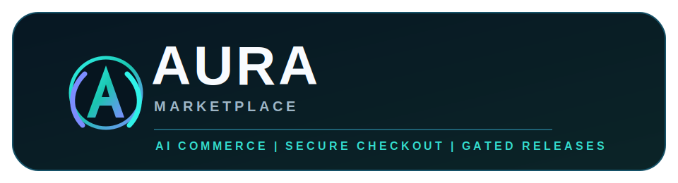
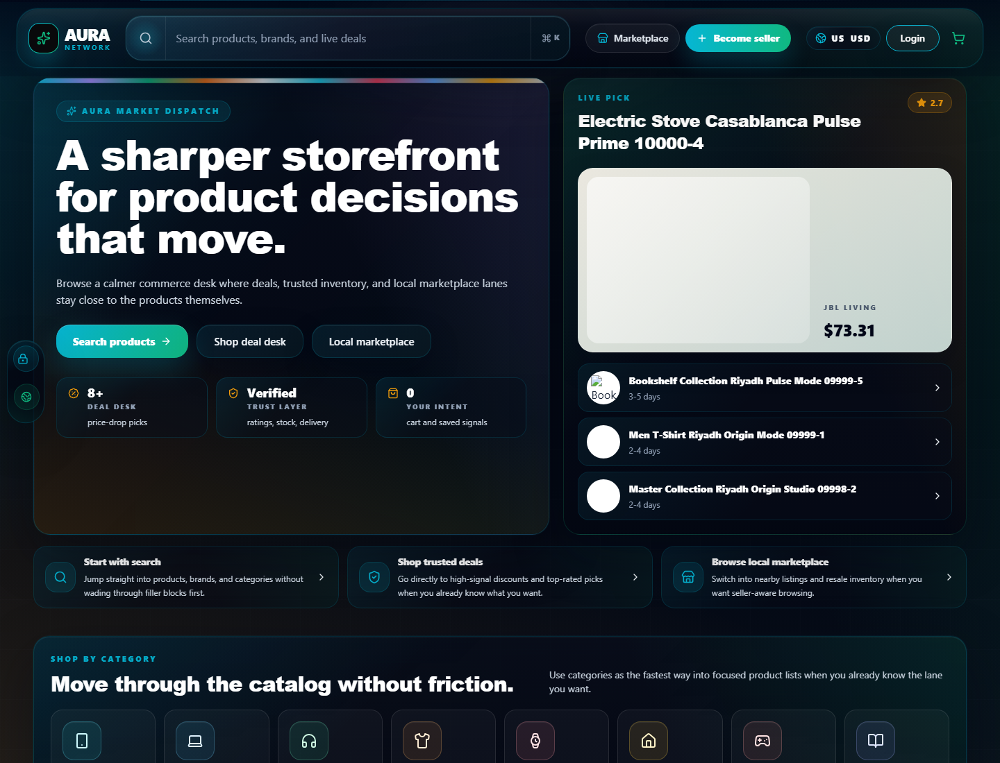
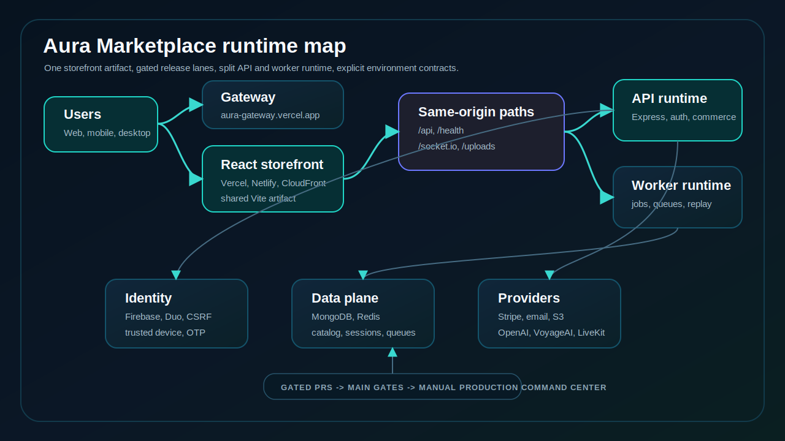

<div align="center">
  <h1>Aura Marketplace</h1>
  <p><strong>AI shopping, secure checkout, and gated production delivery in one commerce operating repo.</strong></p>
  
  <p><strong>One release train. Three storefront hosts. Auth and environment gates that fail closed.</strong></p>
  <p>
    <a href="https://github.com/MdSaifulIslamMSI/Aura/actions/workflows/quality.yml"></a>
    <a href="https://github.com/MdSaifulIslamMSI/Aura/actions/workflows/security.yml"></a>
    <a href="https://github.com/MdSaifulIslamMSI/Aura/actions/workflows/production-on-push.yml"></a>
    <a href="https://github.com/MdSaifulIslamMSI/Aura/actions/workflows/codeql.yml"></a>
  </p>
  <p>
    <a href="https://aurapilot.vercel.app">Live storefront</a> &middot;
    <a href="https://aura-gateway.vercel.app">Gateway</a> &middot;
    <a href="docs/system-architecture.md">Architecture</a> &middot;
    <a href="docs/ci-cd.md">Release gates</a> &middot;
    <a href="docs/security/">Security docs</a>
  </p>
</div>

Aura Marketplace is a production-oriented commerce platform with a React storefront, Express API, AI shopping assistance, resilient identity flows, multi-host frontend delivery, and AWS-backed runtime operations.

This repository is not a demo landing page. It is the operating surface for product discovery, recommendations, cart and checkout, payments, fulfillment workflows, account security, admin controls, observability, release gates, and production rollback discipline.

<p align="center">
  
</p>

## Live Production Surfaces

| Surface | URL | Role |
|---|---|---|
| Gateway | [aura-gateway.vercel.app](https://aura-gateway.vercel.app) | Public gateway and launch surface. |
| Storefront - Vercel | [aurapilot.vercel.app](https://aurapilot.vercel.app) | Primary hosted React storefront. |
| Storefront - Netlify | [aurapilot.netlify.app](https://aurapilot.netlify.app) | Same storefront artifact on Netlify. |
| AWS CloudFront | [dbtrhsolhec1s.cloudfront.net](https://dbtrhsolhec1s.cloudfront.net) | AWS-hosted production surface and same-origin backend proxy target. |

Production pages expose release traceability through `aura-release-id` and `aura-release-commit` meta tags. Treat those tags, the GitHub production workflow run, and read-only health probes as the source of truth for what is live.

## System At A Glance

| Area | Stack | Owns |
|---|---|---|
| [`app/`](app/) | React 19, Vite, React Router, Firebase Web Auth, Vitest, Playwright, Capacitor | Storefront, auth UX, catalog, cart, checkout, orders, admin UI, mobile shell target. |
| [`server/`](server/) | Node.js, Express 5, MongoDB, Redis, Socket.IO, Firebase Admin, Stripe, Duo Universal, OpenAI, VoyageAI | API runtime, worker runtime, auth, commerce, payments, AI, realtime, uploads, jobs, smoke tests. |
| [`gateway/`](gateway/) | Static gateway surface | Public gateway and routing layer. |
| [`desktop/`](desktop/) | Electron | Desktop shell and desktop packaging. |
| [`infra/`](infra/) | AWS, SSM, Docker, OpenTofu, Helm | Backend/frontend cloud automation and infrastructure contracts. |
| [`.github/workflows/`](.github/workflows/) | GitHub Actions | CI, staging, production command center, deploy lanes, desktop/mobile releases. |
| [`docs/`](docs/) | Markdown runbooks and architecture | The deeper operating manual. |

## Product Capabilities

Aura combines the normal commerce path with the systems work needed to operate it safely:

- AI shopping assistant for product search, comparison, product Q&A, buying guidance, and policy answers.
- Hybrid recommendation engine for home shelves, similar products, trending products, cart add-ons, frequently bought together, recently viewed items, and assistant-backed suggestions.
- Authenticated cart, checkout, order, refund, replacement, admin, support, and realtime communication flows.
- Server-authoritative checkout and payment handling, with digital payment intent validation and replay-safe mutation paths.
- Firebase-backed identity, Duo step-up, trusted-device verification, OTP recovery, CSRF protection, and security telemetry.
- Split API and worker runtime so payment, email, catalog, reconciliation, and background jobs are not tied to HTTP traffic spikes.
- Mobile and desktop shells that reuse the hosted storefront while keeping native release lanes available.

Details: [hybrid recommendation system](docs/recommendation-system.md), [system architecture](docs/system-architecture.md), [mobile delivery](docs/mobile-app-delivery.md).

## Runtime Architecture



The hosted storefront is a static React/Vite build published to multiple hosts from the same release artifact. Runtime calls use same-origin paths:

- `/api`
- `/health`
- `/socket.io`
- `/uploads`

Those paths route to the shared backend runtime. The backend is split into:

- API process: Express routes, middleware, realtime socket entrypoints, auth/session enforcement, and public health checks.
- Worker process: payment outbox, order email, catalog, analytics, reconciliation, OTP maintenance, and other background jobs.

MongoDB is the transactional document store. Redis supports realtime coordination, queues, rate limits, and distributed security controls. AWS Parameter Store and checked environment contracts keep deployment state explicit instead of relying on hidden defaults.

Details: [split runtime deployment](docs/split-runtime-deployment.md), [AWS backend deployment](docs/aws-backend-deployment.md), [AWS frontend deployment](docs/aws-frontend-deployment.md), [environment contract](docs/environment-contract.md).

## Quick Start

Prerequisites:

- Node.js and npm compatible with the checked-in lockfiles.
- Local MongoDB and Redis, or the repo-managed local service toggle.
- Local-only environment files based on the examples. Do not commit secrets.

Install dependencies:

```powershell
npm install
npm --prefix app install
npm --prefix server install
```

Prepare local environment files:

```powershell
Copy-Item app\.env.example app\.env
Copy-Item server\.env.example server\.env
```

Start local supporting services when you want the repo-managed Windows toggle:

```powershell
npm run dev:on
```

Run the backend and frontend in separate terminals:

```powershell
npm --prefix server start
```

```powershell
npm --prefix app run dev
```

When finished:

```powershell
npm run dev:off
```

Use `npm run dev:off:force` only when a local service refuses to stop cleanly.

## Verification Ladder

Run the narrowest check that covers the surface you changed. Prefer focused checks first; widen only when the change crosses boundaries.

| Change surface | Focused verification |
|---|---|
| Repo health and CI wiring | `npm run ci:doctor` |
| Frontend unit behavior | `npm --prefix app test` |
| Frontend production build | `npm --prefix app run build` |
| Backend regression slice | `npm test` |
| Backend focused test | `npm --prefix server test -- --runTestsByPath tests/<name>.test.js` |
| Auth and Duo posture | `npm run security:duo` |
| Sensitive route coverage | `npm run security:routes:coverage:strict` |
| Environment contract | `npm run smoke:env-contract` |
| Staging readiness | `npm run staging:readiness` |
| Main branch protection policy | `npm run github:main-protection` |
| Production mutation guard | `npm run release:production-mutation-gate` |

The default root `npm test` command runs the curated backend regression tracer, not every test in the repository.

## Release And Deployment Model

Aura uses gated release lanes instead of ad hoc production mutation:

- Pull requests build and test the changed surface before merge.
- A push to `main` runs the non-mutating production gate path.
- Real production actions run through the manual production command center and require the explicit `PRODUCTION` confirmation input.
- Storefront production deploys publish the same built artifact to the configured hosts.
- Backend production deploys use AWS OIDC, S3 release bundles, SSM Run Command, and explicit runtime environment contracts.
- Rollback, desktop, mobile, gateway, backend, and storefront lanes are selected intentionally instead of all running by accident.

Details: [CI/CD guide](docs/ci-cd.md).

## Security And Safety Posture

Aura is built to fail closed when runtime intent is ambiguous:

- Secrets stay out of source control; example env files contain shape, not real credentials.
- Local release credential checks are fail-closed: `npm run credentials:setup:local-release-sso` and `npm run credentials:check:local-release`.
- Staging is not treated as staging unless it has isolated backend, database/cache/storage, and SSM prefix contracts.
- Frontend code is scanned for secret exposure and route exposure drift.
- State-changing auth routes use CSRF controls.
- OTP and recovery flows fail closed on unsafe delivery or stale proof.
- Privileged device verification uses browser-held trusted-device material and server-enforced tokens.
- Duo step-up is handled as a server-side auth boundary, not a cosmetic UI challenge.
- Checkout totals, privilege, ownership, payment state, and admin authority are enforced server-side.

Security docs:

- [Zero-trust sensitive actions](docs/security/zero-trust-sensitive-actions.md)
- [Invisible app fabric](docs/security/invisible-app-fabric.md)
- [Secretless frontend](docs/security/secretless-frontend.md)
- [Trusted device architecture](docs/trusted-device-architecture.md)
- [Post-quantum readiness](docs/security/post-quantum-readiness.md)

## Catalog, Search, And AI Data

Production catalog imports require source and manifest references. Synthetic demo catalog data is for local and staging demonstrations only and must not be represented as real production merchandise.

Useful commands:

```powershell
npm --prefix server run catalog:validate-snapshot
npm --prefix server run catalog:kaggle:prepare -- --dataset owner/dataset
npm --prefix server run catalog:kaggle:import -- --dataset owner/dataset
npm --prefix server run search:report
```

AI and recommendation behavior should remain grounded in catalog data, user or session activity, cart context, product similarity, popularity signals, and explicit assistant tools.

## Operations Index

| Need | Start here |
|---|---|
| System shape | [docs/system-architecture.md](docs/system-architecture.md) |
| Recommendation engine | [docs/recommendation-system.md](docs/recommendation-system.md) |
| CI/CD and production command center | [docs/ci-cd.md](docs/ci-cd.md) |
| Environment contracts | [docs/environment-contract.md](docs/environment-contract.md) |
| Split backend runtime | [docs/split-runtime-deployment.md](docs/split-runtime-deployment.md) |
| AWS backend | [docs/aws-backend-deployment.md](docs/aws-backend-deployment.md) |
| AWS frontend | [docs/aws-frontend-deployment.md](docs/aws-frontend-deployment.md) |
| Mobile apps | [docs/mobile-app-delivery.md](docs/mobile-app-delivery.md) |
| FX rate pipeline | [docs/fx-rate-pipeline.md](docs/fx-rate-pipeline.md) |
| Security evidence | [docs/security/](docs/security/) |

## Maintainer Notes

- Keep this README as the current front door, not a historical changelog.
- Put deep operational detail in `docs/` and link it from here.
- Keep production claims evidence-backed by workflow runs, release markers, or read-only probes.
- Do not widen deploy, auth, payment, catalog, migration, or secret-handling changes while updating documentation.
