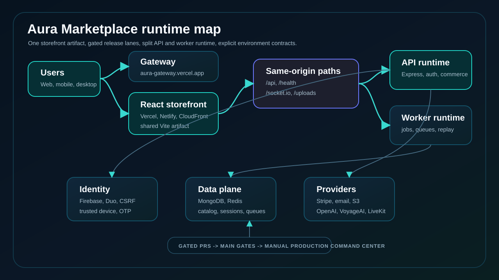

<div align="center">
  

  [](https://github.com/MdSaifulIslamMSI/Aura/actions/workflows/quality.yml)
  [](https://github.com/MdSaifulIslamMSI/Aura/actions/workflows/security.yml)
  [](https://github.com/MdSaifulIslamMSI/Aura/actions/workflows/production-on-push.yml)
  [](https://github.com/MdSaifulIslamMSI/Aura/actions/workflows/codeql.yml)

  [Live storefront](https://aurapilot.vercel.app) &middot; [Gateway](https://aura-gateway.vercel.app) &middot; [Architecture](docs/system-architecture.md) &middot; [Release gates](docs/ci-cd.md) &middot; [Security](SECURITY.md)
</div>

---

Aura Marketplace is a production commerce platform: a React storefront, an Express API, AI shopping assistance, and the release engineering required to run all of it safely. Product discovery, cart, checkout, payments, refunds, admin tooling, realtime support, observability, and rollback all live in this one repository.

The system runs on three storefront hosts served from the same built artifact, with auth and environment gates that fail closed.

## Live Surfaces

| Surface | URL | Role |
|---|---|---|
| Gateway | [aura-gateway.vercel.app](https://aura-gateway.vercel.app) | Public gateway and launch surface |
| Storefront (Vercel) | [aurapilot.vercel.app](https://aurapilot.vercel.app) | Primary hosted storefront |
| Storefront (Netlify) | [aurapilot.netlify.app](https://aurapilot.netlify.app) | Same artifact on Netlify |
| Storefront (CloudFront) | [dbtrhsolhec1s.cloudfront.net](https://dbtrhsolhec1s.cloudfront.net) | AWS-hosted surface, same-origin backend proxy target |

Deployed pages carry `aura-release-id` and `aura-release-commit` meta tags. Those tags, the production workflow run, and read-only health probes are the source of truth for what is live.

## Stack

| Area | Technologies | Responsibilities |
|---|---|---|
| [`app/`](app/) | React 19, Vite, React Router, Firebase Web Auth, Vitest, Playwright, Capacitor | Storefront, auth UX, catalog, cart, checkout, orders, admin UI, mobile shell |
| [`server/`](server/) | Node.js, Express 5, MongoDB, Redis, Socket.IO, Firebase Admin, Stripe, Razorpay, Duo Universal | API runtime, worker runtime, auth, payments, fraud controls, AI, realtime, uploads |
| [`desktop/`](desktop/) | Electron | Desktop shell for Windows, macOS, Linux |
| [`infra/`](infra/) | AWS, SSM, CloudFormation, OpenTofu | Cloud automation and infrastructure contracts |
| [`.github/workflows/`](.github/workflows/) | GitHub Actions | CI, staging, gated production deploys, desktop and mobile release lanes |

## What It Does

- **Commerce.** Catalog with search and filters, cart, wishlist, checkout with server-authoritative totals, orders, refunds, replacements, C2C marketplace listings, loyalty, trade-in, price alerts.
- **Payments.** Stripe and Razorpay behind a provider contract with state machines, a ledger, idempotency records, and an outbox that retries refund and webhook work until it converges.
- **AI assistant.** Product search, comparison, Q&A, and buying guidance grounded in catalog data. Provider registry spans Groq, Voyage AI, Gemini, Ollama, ElevenLabs, and LiveKit voice, each wrapped in circuit breakers with heuristic fallbacks when keys are absent.
- **Recommendations.** Hybrid engine for home shelves, similar products, trending, cart add-ons, frequently bought together, and recently viewed. See [docs/recommendation-system.md](docs/recommendation-system.md).
- **Identity.** Firebase auth, TOTP and Duo step-up MFA, WebAuthn trusted devices, OTP recovery codes, DPoP-bound requests, CSRF protection on state-changing routes.
- **Realtime and support.** Socket.IO over a Redis adapter, LiveKit video calls, order email queue, Twilio SMS and WhatsApp.
- **Admin.** Sixteen control surfaces covering orders, payments, refunds, users, fraud, abuse, security audit, emergency controls, and status.

## Runtime Architecture



One static React build is published to Vercel, Netlify, and S3/CloudFront. Runtime calls use same-origin paths (`/api`, `/health`, `/socket.io`, `/uploads`) that route to the shared backend:

- **API process** handles Express routes, middleware, socket entrypoints, session enforcement, and health checks.
- **Worker process** owns payment outbox draining, order email, catalog sync, analytics, reconciliation, and OTP maintenance, so background jobs survive HTTP traffic spikes.
- **MongoDB** is the transactional store. **Redis** coordinates realtime, rate limits, and distributed security controls. **AWS Parameter Store** plus checked environment contracts keep deployment state explicit.

Details: [split runtime](docs/split-runtime-deployment.md), [AWS backend](docs/aws-backend-deployment.md), [AWS frontend](docs/aws-frontend-deployment.md), [environment contract](docs/environment-contract.md).

## Quick Start

Prerequisites: Node.js and npm matching the checked-in lockfiles, local MongoDB and Redis (or `npm run dev:on` to manage them on Windows).

```powershell
npm install
npm --prefix app install
npm --prefix server install

Copy-Item app\.env.example app\.env
Copy-Item server\.env.example server\.env
```

Run the backend and frontend in separate terminals:

```powershell
npm --prefix server start
npm --prefix app run dev
```

Stop local services when finished:

```powershell
npm run dev:off
```

## Verification Ladder

Run the narrowest check that covers what you changed. The root `npm test` command is a curated backend regression tracer (33 suites, 435 tests), not the full repository suite.

| Change surface | Command |
|---|---|
| Repo health and CI wiring | `npm run ci:doctor` |
| Backend regression slice | `npm test` |
| One backend test file | `npm --prefix server test -- --runTestsByPath tests/<name>.test.js` |
| Frontend unit behavior | `npm --prefix app test` |
| Frontend production build | `npm --prefix app run build` |
| Auth and Duo posture | `npm run security:duo` |
| Sensitive route coverage | `npm run security:routes:coverage:strict` |
| Environment contract | `npm run smoke:env-contract` |
| Staging readiness | `npm run staging:readiness` |

Coverage floors are enforced, not decorative: the backend gate requires 34% statements / 47% branches / 26% functions / 34% lines across controllers, services, middleware, and models; the frontend gate requires 62 / 51 / 59 / 63. Both numbers sit just under measured values so regressions fail CI instead of accumulating quietly.

## Release Model

Production changes go through gates, not ad hoc deploys.

- Pull requests build and test the changed surface before merge. Branch protection requires eleven named checks, strict branch freshness, and conversation resolution; a script verifies that protection policy from CI rather than trusting console settings.
- A push to `main` runs non-mutating preflight only. Real production actions require a manual workflow dispatch typed with `PRODUCTION`, from `main`.
- All mutating workflows share one concurrency lock, so deploy and rollback lanes cannot interleave.
- Staging promotion requires the same commit SHA that reaches production, a versioned backup, and a proven isolated restore inside the staging pipeline.
- Rollback readiness is evidence-backed: deploys block without rollback artifacts, and post-deploy smoke failures can trigger per-provider automatic rollback.

Details: [CI/CD guide](docs/ci-cd.md).

## Security Posture

The design rule is to fail closed whenever runtime intent is ambiguous.

- Secrets stay out of source control. Example env files contain shape, not credentials, and scans enforce it (gitleaks, secretless-frontend checks).
- Checkout totals, ownership, privilege, payment state, and admin authority are enforced server-side.
- State-changing auth routes use CSRF tokens bound to the authenticated owner. Privileged device verification uses browser-held trusted-device material and server-enforced tokens.
- OTP and recovery flows fail closed on unsafe delivery or stale proof. Duo step-up runs as a server-side boundary, not a UI prompt.
- Route exposure drift, invisible endpoints, and internal surface leaks are checked by dedicated scanners (`npm run security:invisible-fabric`).
- Traffic resilience is budgeted per route class with load shedding, attack-mode guards, and emergency kill switches tested under `traffic:fortress:*`.

Security documentation lives in [docs/security/](docs/security/), including [zero-trust sensitive actions](docs/security/zero-trust-sensitive-actions.md), [secretless frontend](docs/security/secretless-frontend.md), and [post-quantum readiness](docs/security/post-quantum-readiness.md).

## Catalog, Search, And AI Data

Production catalog imports require a source and manifest reference. Synthetic demo data exists for local and staging demos only.

```powershell
npm --prefix server run catalog:validate-snapshot
npm --prefix server run catalog:kaggle:prepare -- --dataset owner/dataset
npm --prefix server run search:report
```

AI behavior stays grounded in catalog data, session activity, cart context, product similarity, popularity signals, and explicit assistant tools. See [hybrid recommendations](docs/recommendation-system.md) and the [FX rate pipeline](docs/fx-rate-pipeline.md) for adjacent pipelines.

## Operations Index

| Need | Start here |
|---|---|
| System shape | [docs/system-architecture.md](docs/system-architecture.md) |
| Recommendation engine | [docs/recommendation-system.md](docs/recommendation-system.md) |
| CI/CD and production command center | [docs/ci-cd.md](docs/ci-cd.md) |
| Environment contracts | [docs/environment-contract.md](docs/environment-contract.md) |
| Split backend runtime | [docs/split-runtime-deployment.md](docs/split-runtime-deployment.md) |
| AWS backend / frontend | [docs/aws-backend-deployment.md](docs/aws-backend-deployment.md) / [docs/aws-frontend-deployment.md](docs/aws-frontend-deployment.md) |
| Mobile apps | [docs/mobile-app-delivery.md](docs/mobile-app-delivery.md) |
| Security evidence | [docs/security/](docs/security/) |

## Maintainer Notes

- This README is the front door, not a changelog. Put operational depth in `docs/` and link it here.
- Keep production claims backed by workflow runs, release markers, or read-only probes.
- Private readiness probes are token-gated; production requires `x-health-token`.

## License

[ISC](LICENSE)
