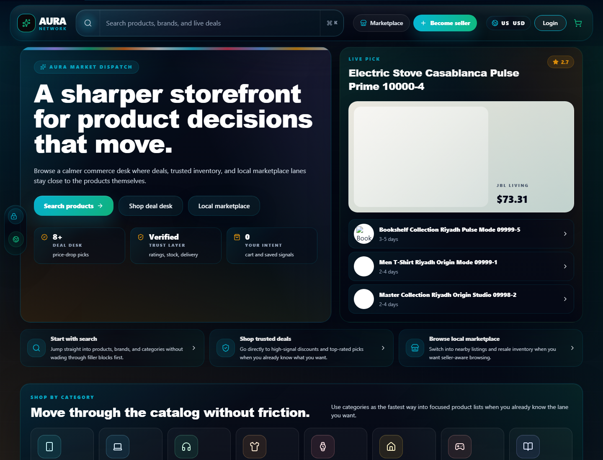
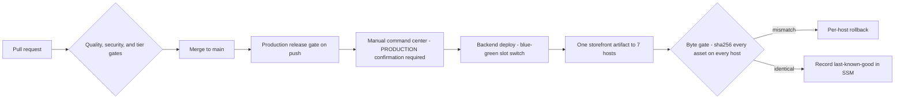

<div align="center">


**A production-grade commerce platform — AI-assisted shopping, bank-grade checkout integrity, and a byte-verified release train.**

One release train. Seven storefront hosts. Byte-identical and fail-closed.

[](https://github.com/MdSaifulIslamMSI/Aura/actions/workflows/quality.yml)
[](https://github.com/MdSaifulIslamMSI/Aura/actions/workflows/security-gates.yml)
[](https://github.com/MdSaifulIslamMSI/Aura/actions/workflows/codeql.yml)
[](https://github.com/MdSaifulIslamMSI/Aura/actions/workflows/production-on-push.yml)
[](https://github.com/MdSaifulIslamMSI/Aura/actions/workflows/nightly-tests.yml)
[](LICENSE)

[Storefront](https://aurapilot.vercel.app) &middot; [Host fleet](#live-production-surfaces) &middot; [Gateway](https://aura-gateway.vercel.app) &middot; [Status page](https://aurapilot.vercel.app/status) &middot; [Architecture](docs/system-architecture.md) &middot; [Security](SECURITY.md) &middot; [The story](AURA-STORY.md)

**1,688** commits &nbsp;·&nbsp; **≈550K** lines of first-party code &nbsp;·&nbsp; **714** test files &nbsp;·&nbsp; **50** workflows &nbsp;·&nbsp; **20** languages &nbsp;·&nbsp; **11** currencies &nbsp;·&nbsp; **7** storefront hosts

</div>

<p align="center">
  
</p>

---

## Why Aura exists

Aura Marketplace is a full-stack commerce platform: a React 19 storefront with an AI shopping assistant that takes real actions, an Express/MongoDB commerce core engineered for money correctness, and a production operation with gated deploys, byte-verified multi-host delivery, and rollback discipline.

This repository is not a demo landing page. It is the operating surface for product discovery, recommendations, cart and checkout, payments, fulfillment workflows, account security, admin controls, observability, release gates, and production rollback. Every number on this page is traceable to a file, a workflow, or a command.

## Aura by the numbers

| Indicator | Value | Receipt |
|---|---:|---|
| Commits | 1,688 | `git rev-list --count HEAD` |
| Tracked files | 3,025 | `git ls-files` |
| First-party source | ≈550,000 lines | `app/src` · `server` · `desktop` · `scripts` |
| Frontend unit tests | 229 files, ~1,578 cases | `app/src/**/*.test.*` (Vitest) |
| Backend test files | 461 | `server/tests/` (Jest) |
| Tiered suites | 190 regression · 254 nightly · 0 quarantine | `config/test-tiers.json` |
| Playwright E2E | 15 specs, 55 cases | `app/e2e/` |
| Desktop tests | 9 files, 60 cases | `desktop/*.test.cjs` |
| GitHub Actions workflows | 50, incl. 9 rollback lanes | `.github/workflows/` |
| npm scripts | 260 | root `package.json` |
| Documentation | 230+ markdown docs | `docs/` + root |
| Languages · currencies | 20 (+RTL) · 11 | `app/src/config/marketConfig.js` |
| Storefront hosts | 7, byte-identical | `deploy-netlify.yml` byte gate |
| Catalog scale | 1,000,000-product dataset | `server/data/catalog_1m.jsonl` |

---

## The product

### 🛍️ Commerce core

- 30+ routed pages: faceted catalog with URL-round-trip filters, product detail with rating breakdowns and photo reviews, wishlist, downloadable invoices, order tracking, cancellation, and returns.
- 5-step checkout (address → delivery → payment → review) with an OTP challenge modal, COD / UPI / card / wallet / net-banking payment methods, and coupons validated against a live quote API.
- Cart state engineering: optimistic mutations with revision-conflict replay, cross-tab sync over `BroadcastChannel`, guest cart and wishlist that merge on login — all unit-tested.
- Aura Points loyalty command center (tiers, streaks, milestones), trade-in estimator, price alerts, bundles, and a C2C marketplace with seller profiles and listings.

### 🤖 AI shopping assistant

- A terminal-style assistant page plus a page-context dock — it carries the context of whatever you are looking at.
- Real actions, not just chat: navigate, search, open products, add to cart, apply coupons, go to checkout, cancel orders, create returns, open order tracking — destructive actions are confirmation-gated through a shared capability manifest with the backend.
- Multimodal input (images + audio), inline product cards, and support-desk handoff.
- Provider mesh behind a fallback-chain gateway: Google Gemini, Ollama, OpenCode Zen, and Groq — with Voyage AI embeddings, ElevenLabs speech, and LiveKit realtime voice.
- Grounded agent loop: five read-only tools, four iterations max, and final product IDs intersected with actually-observed results, so the model cannot invent products. A promptfoo red-team corpus runs in CI.
- Degrades gracefully: E2E-proven to work with every model provider disabled, behind a feature kill-switch.

### 🔐 Identity and trust

- Firebase-backed identity with server-side sessions (rotation, CSRF token pairs, supersede/revoke), phone OTP, passkeys/WebAuthn, TOTP + recovery codes, trusted-device verification, and Duo OIDC step-up.
- Cloudflare Turnstile on OTP, recovery, and device-challenge surfaces.
- Distributed rate limiting (Redis-backed with in-memory fallback and a circuit breaker), login lockout, geo-velocity and behavior-baseline risk engines, abuse shield, and load shedding.
- Field-level encryption at rest: AES-256-GCM envelope encryption with AWS KMS data keys, zero-downtime rotation, and HMAC-SHA256 blind indexes that keep encrypted phone/email searchable.
- The route-security matrix test derives every route from source and fails CI unless each state-changing route declares — and enforces — its security posture.

### 🌍 Global by design

- 20 human languages including RTL Urdu and Arabic, plus an `en-XA` pseudo-locale QA pipeline — FormatJS/ICU extraction, structural verification, glossary, and per-locale axe accessibility checks in CI.
- 11 currencies with live FX refresh and region-aware presentation.
- A public status page with uptime bars, incident history, and subscriptions.

### 🖥️ Desktop and mobile

- Electron 44 desktop app: signed auto-updates, OS-keychain secret storage via `safeStorage` (memory-only fallback), a loopback OAuth handoff broker, an HTTPS-only hardened proxy, and code-signing/notarization gates in the release lane.
- Capacitor 8 shell for Android and iOS: native social sign-in providers, splash and status-bar theming, and a strict `allowNavigation` allowlist.
- PWA: installable manifest with app shortcuts and a versioned service worker (app-shell fallback; API and sockets always hit the network).

### 📡 Operate in public

- Admin emergency controls with feature kill-switches, plus a client-diagnostics bus surfaced in an admin panel.
- Nightly test fleet (254 suites) with a quarantine ratchet; a 30-minute uptime probe; and a workflow status watcher feeding the status page.
- Sentry and Datadog RUM wired end to end, with sourcemaps uploaded per release.

---

## Architecture

<p align="center">
  
</p>

The hosted storefront is a static React/Vite build published to multiple hosts from one release artifact. Runtime calls use same-origin paths — `/api`, `/health`, `/socket.io`, `/uploads` — which route to the shared backend runtime.

The backend is split into two processes:

- **API process** — Express routes, middleware, realtime Socket.IO entrypoints (Firebase-authenticated sockets with a Redis backplane), auth/session enforcement, and health checks.
- **Worker process** — payment outbox, order email, catalog, reconciliation, order lifecycle, analytics, status, and OTP maintenance jobs, with its own readiness probe. A spike that kills HTTP traffic does not kill background work.

MongoDB is the transactional store. Redis coordinates rate limits, queues, realtime, and distributed security controls. AWS Parameter Store and checked environment contracts keep deployment state explicit — no hidden defaults.

Details: [system architecture](docs/system-architecture.md) · [split runtime](docs/split-runtime-deployment.md) · [environment contract](docs/environment-contract.md)

## The release train


```mermaid
flowchart LR
    A[Pull request] --> B{Quality, security, and tier gates}
    B --> C[Merge to main]
    C --> D[Production release gate on push]
    D --> E[Manual command center - PRODUCTION confirmation required]
    E --> F[Backend deploy - blue-green slot switch]
    F --> G[One storefront artifact to 7 hosts]
    G --> H{Byte gate - sha256 every asset on every host}
    H -->|mismatch| I[Per-host rollback]
    H -->|identical| J[Record last-known-good in SSM]
```

- Pull requests build and test the changed surface; a push to `main` runs the non-mutating production gate.
- Real production actions run through the manual production command center and require the explicit `PRODUCTION` confirmation input, after twelve release gates (tests, security, env contract, staging smokes, cost guard, observability guard, rollback readiness, synthetic and latency SRE checks).
- Storefront deploys publish **the same built artifact** to all hosts, then the byte gate fetches each host's shell HTML and every referenced asset, hashes them with SHA-256, and fails if any host serves different bytes.
- Every deploy target has a matched rollback workflow (9 lanes), and deploys record a last-known-good pointer for one-command recovery.

Details: [CI/CD and command center](docs/ci-cd.md) · [rollback runbook](docs/rollback-runbook.md)

## Live production surfaces

| Surface | URL | Role |
|---|---|---|
| Gateway | [aura-gateway.vercel.app](https://aura-gateway.vercel.app) | Public gateway and launch surface. |
| Storefront — Vercel | [aurapilot.vercel.app](https://aurapilot.vercel.app) | Primary hosted React storefront. |
| Storefront — Netlify | [aurapilot.netlify.app](https://aurapilot.netlify.app) | Same artifact on Netlify. |
| Storefront — AWS CloudFront | [dbtrhsolhec1s.cloudfront.net](https://dbtrhsolhec1s.cloudfront.net) | AWS-hosted surface and same-origin backend proxy target. |
| Storefront — Render | [aura-storefront.onrender.com](https://aura-storefront.onrender.com) | Same artifact on Render with backend rewrites. |
| Storefront — Railway | [aura-storefront-production.up.railway.app](https://aura-storefront-production.up.railway.app) | Same artifact rebuilt on Railway with the CI build-env contract. |
| Storefront — Cloudflare Pages | [aura-storefront.pages.dev](https://aura-storefront.pages.dev) | Same artifact uploaded directly to Cloudflare Pages. |
| Storefront — GitHub Pages | [mdsaifulislammsi.github.io](https://mdsaifulislammsi.github.io) | Same artifact on the user-site repo. |
| Status page | [aurapilot.vercel.app/status](https://aurapilot.vercel.app/status) | Public uptime, incidents, and subscriptions. |

Production pages expose release traceability through `aura-release-id` and `aura-release-commit` meta tags. Treat those tags, the GitHub production workflow run, and read-only health probes as the source of truth for what is live.

---

## Engineering deep dives

<details>
<summary><strong>🛡️ Security fortress</strong></summary>

- **Field-level encryption** (`server/services/fieldEncryptionService.js`): per-record AES-256-GCM with fresh IVs; DEKs exist only in process memory, wrapped by AWS KMS and persisted as an SSM SecureString to survive restarts; versioned ciphertext format enables zero-downtime key rotation; a single flag is the kill switch.
- **Searchable ciphertext**: deterministic HMAC-SHA256 blind indexes (`blindIndexService.js`) power phone/email lookups with no plaintext fallback.
- **CI scanners**: CodeQL, a custom Semgrep policy for Aura-specific patterns, Gitleaks, Trivy, CheckOV, OSV-Scanner, zizmor (Actions audit), OpenSSF Scorecard, and dependency review — consolidated into a 7-job security gate.
- **Edge verification**: a self-hosted ModSecurity/CRS + CrowdSec WAF is continuously verified against SQLi, XSS, traversal, and command-injection probes in CI.
- **AI guardrails**: a promptfoo red-team corpus runs against the assistant prompt guard and fails the build on any miss.
- **Post-quantum readiness**: an OpenSSL 3.5 PQC lab evaluates migration paths before they are needed.

Further reading: [security architecture](docs/security/security-architecture.md) · [threat model](docs/security/threat-model.md) · [zero-trust sensitive actions](docs/security/zero-trust-sensitive-actions.md) · [secretless frontend](docs/security/secretless-frontend.md) · [trusted-device architecture](docs/trusted-device-architecture.md) · [security maturity scorecard](docs/security/security-maturity-scorecard.md)

</details>

<details>
<summary><strong>💰 Money correctness</strong></summary>

- **Double-entry ledger** with named accounts (platform cash, fees, processor clearing, user receivables/wallet, pending refunds/disputes) — all money in minor units, enforced by a dedicated audit script.
- **Payment router** chooses between Razorpay (default) and optional Stripe routing by success rate, fees, BIN affinity, health, and latency; production fails closed without configured credentials.
- **Webhook integrity**: HMAC verification over raw bytes, Mongo-anchored idempotency records (24h TTL + processing locks), payment-reference replay detection returning 409, and TOCTOU-safe capture transitions — a provider-side double capture can never strand an order.
- **Capture-failure compensation**: race-safe order cancellation, stock release, and deduped admin alerts registered as the terminal capture-failure handler.
- **Write-ahead refunds**: refund jobs are queued in the payment outbox before execution and skipped if already resolved.
- **Lifecycle workers**: courier webhooks with per-provider HMAC and event dedupe ledgers, 60-minute auto-cancel for unpaid orders, COD aging alerts, and loyalty clawback on cancellation.

Further reading: [payment architecture](docs/payment-architecture.md) · [payment runbook](docs/payment-runbook.md) · [critical invariants](docs/critical-invariants.md)

</details>

<details>
<summary><strong>⚡ Performance</strong></summary>

- **Sort-covering index family** on the product catalog ends in-memory blocking sorts for every listing sort mode; connection pools are warmed and widened for Atlas TLS behavior.
- **Search**: MongoDB Atlas Search when the cluster supports it, with a live availability probe, zero-results regex retry, and an automatic degraded-mode regex fallback marked in API responses — search never goes dark, it degrades loudly.
- **Caching**: version-keyed in-process caches (15s filters, 30s identifiers, 60s recommendation pools) invalidated on catalog writes.
- **Budgets in CI**: `docs/performance-budgets.json` gates gzip eager-shell JS, mobile initial payload, CSS totals, tap-target sizes, and interaction-blocking time; Lighthouse CI requires performance ≥ 0.85, LCP ≤ 2.5s, CLS ≤ 0.1, TBT ≤ 300ms; k6 runs eight safe load scenarios with a p95 < 1.5s threshold.
- **Memory caps**: API 768MB (512MB heap), worker 640MB (384MB heap), Redis 256MB volatile-LRU — heap caps sit below container caps so OOMs restart in-process instead of killing the box.
- **TTL indexes** bound OTP sessions, idempotency records, security-event outboxes, listings, and telemetry retention.

Further reading: [performance contract](docs/performance-contract.md) · [performance runbook](docs/performance-runbook.md) · [database audit](docs/database-audit-2026-09-07.md)

</details>

<details>
<summary><strong>📈 Reliability and data safety</strong></summary>

- **Observability stack**: OpenTelemetry Collector → Prometheus, Grafana, Loki, and Promtail; bearer-protected `/metrics`; `/health`, `/health/live`, and `/health/ready` on both API and worker processes; Alertmanager wired to the status page via a two-phase activation workflow.
- **Backups**: nightly Atlas dumps to S3 via SSM — versioned bucket, KMS-encrypted archives, 35-day retention, and an isolated restore-drill job that proves recoverability rather than assuming it.
- **Probes**: a 30-minute liveness probe treats an unconfigured probe as a P0; a status watcher follows 13 workflows.
- **Test tiers**: every backend suite is triaged into regression (190), nightly (254), or quarantine (0) — the untriaged count must stay zero or CI fails the ratchet.
- **SRE**: SLO definitions, latency budgets, synthetic checks, and a rollback-after-bad-latency runbook.

Further reading: [SLOs](docs/sre/slo.md) · [latency and reliability budgets](docs/sre/latency-and-reliability-budgets.md) · [incident runbook](docs/incident-runbook.md) · [runbooks](docs/runbooks/)

</details>

---

## Tech stack

| Layer | Stack |
|---|---|
| Storefront | React 19.3, Vite 8.3, React Router 7, Tailwind CSS 4, framer-motion, PWA service worker |
| State | zustand 5 stores + React Context; optimistic commerce runtime with cross-tab sync |
| i18n | FormatJS / react-intl 10, ICU message packs, pseudo-locale QA pipeline |
| Backend | Node 26 runtime, Express 5.2, Helmet/CSP, zod, prom-client |
| Data | MongoDB (Mongoose 9.9.4), Redis 6, TTL-indexed collections, Atlas Search |
| Realtime | Socket.IO 4.8 with Redis adapter backplane, LiveKit voice/video |
| AI | Gemini · Ollama · OpenCode Zen · Groq · Voyage embeddings · ElevenLabs TTS |
| Payments | Razorpay + optional Stripe routing, double-entry ledger, payment outbox |
| Desktop | Electron 44, electron-builder, electron-updater, safeStorage |
| Mobile | Capacitor 8 (Android + iOS), native Firebase auth providers |
| Testing | Vitest 5, Jest, Playwright 1.63, axe-core, visual regression, k6, Lighthouse CI |
| CI/CD | 50 GitHub Actions workflows, 12-gate production command center, 9 rollback lanes |
| Observability | OpenTelemetry, Prometheus, Grafana, Loki, Alertmanager, Sentry, Datadog RUM |
| Cloud | AWS EC2/S3/CloudFront/SSM/KMS via OIDC, Docker Compose, OpenTofu, self-hosted edge WAF |

## Repository map

| Area | Scale | Owns |
|---|---|---|
| [`app/`](app/) | ~306K lines, 229 test files | React storefront, AI assistant UX, admin suite, PWA, Capacitor shell, Playwright E2E |
| [`server/`](server/) | ~214K lines incl. 461 test files | Express API, worker runtime, auth, commerce, payments, AI gateways, jobs |
| [`desktop/`](desktop/) | ~4K lines, 60 tests | Electron main process, secure storage, auth handoff, hardened proxy |
| [`gateway/`](gateway/) | static site | Public gateway and release-link directory |
| [`infra/`](infra/) | scripts + IaC | AWS automation, blue-green deploy scripts, edge WAF, OpenTofu, PQC lab |
| [`scripts/`](scripts/) | ~28K lines, 234 files | CI doctors, validators, generators, rollback and smoke tooling |
| [`docs/`](docs/) | 230+ documents | Architecture, security, payments, SRE, runbooks, ADRs |
| [`.github/workflows/`](.github/workflows/) | 50 workflows | CI, security gates, deploy lanes, rollback lanes, nightly fleet |

---

## Quick start

Prerequisites: Node.js 24+ and npm (production pins the runtime to Node 26), local MongoDB and Redis or the repo-managed toggle, and local-only env files copied from the examples. Never commit secrets.

```powershell
# 1. Install
npm install
npm --prefix app install
npm --prefix server install

# 2. Local environment files (shape only, no real credentials)
Copy-Item app\.env.example app\.env
Copy-Item server\.env.example server\.env

# 3. Start repo-managed local Mongo + Redis (Windows toggle)
npm run dev:on

# 4. Run the backend and frontend in separate terminals
npm --prefix server start
npm --prefix app run dev

# 5. When finished
npm run dev:off
```

Use `npm run dev:off:force` only when a local service refuses to stop cleanly.

## Verification ladder

Run the narrowest check that covers the surface you changed; widen only when the change crosses boundaries.

| Change surface | Focused verification |
|---|---|
| Repo health and CI wiring | `npm run ci:doctor` |
| Frontend unit behavior | `npm --prefix app test` |
| Frontend production build + bundle budgets | `npm --prefix app run build` · `npm run perf:budget` |
| Backend regression slice | `npm test` |
| Backend focused test | `npm --prefix server test -- --runTestsByPath tests/<name>.test.js` |
| New backend suite triage | `node scripts/check-test-tiers.cjs` |
| Auth and Duo posture | `npm run security:duo` |
| Sensitive route coverage | `npm run security:routes:coverage:strict` |
| Environment contract | `npm run smoke:env-contract` |
| i18n keys and quality | `npm run test:i18n` |
| Reliability suites | `npm run test:reliability` |
| Staging readiness | `npm run staging:readiness` |
| Main branch protection policy | `npm run github:main-protection` |
| Production mutation guard | `npm run release:production-mutation-gate` |

The default root `npm test` runs the curated backend regression tracer (190 suites), not every test in the repository.

## Documentation map

**Architecture and operations** — [system architecture](docs/system-architecture.md) · [CI/CD and command center](docs/ci-cd.md) · [split runtime](docs/split-runtime-deployment.md) · [environment contract](docs/environment-contract.md) · [AWS backend](docs/aws-backend-deployment.md) · [AWS frontend](docs/aws-frontend-deployment.md) · [mobile delivery](docs/mobile-app-delivery.md) · [FX rate pipeline](docs/fx-rate-pipeline.md)

**Security** — [security architecture](docs/security/security-architecture.md) · [threat model](docs/security/threat-model.md) · [zero-trust sensitive actions](docs/security/zero-trust-sensitive-actions.md) · [invisible app fabric](docs/security/invisible-app-fabric.md) · [secretless frontend](docs/security/secretless-frontend.md) · [route exposure registry](docs/security/route-exposure-registry.md) · [post-quantum readiness](docs/security/post-quantum-readiness.md) · [security docs index](docs/security/)

**Money** — [payment architecture](docs/payment-architecture.md) · [payment runbook](docs/payment-runbook.md) · [critical invariants](docs/critical-invariants.md) · [database audit](docs/database-audit-2026-09-07.md) · [system design audit](docs/system-design-audit-2026-09-08.md)

**Performance and SRE** — [performance contract](docs/performance-contract.md) · [performance budgets](docs/performance-budgets.json) · [SLOs](docs/sre/slo.md) · [latency and reliability budgets](docs/sre/latency-and-reliability-budgets.md) · [incident runbook](docs/incident-runbook.md) · [rollback runbook](docs/rollback-runbook.md) · [operational runbooks](docs/runbooks/)

**Quality and i18n** — [i18n static template coverage](docs/i18n-static-template-coverage.md) · [recommendation system](docs/recommendation-system.md) · [trusted-device architecture](docs/trusted-device-architecture.md) · [architecture decision records](docs/adr/)

## Contributing, security, and license

- Contributing: [CONTRIBUTING.md](CONTRIBUTING.md) — keep changes surgical, follow the verification ladder, and add tests for anything money- or auth-adjacent.
- Security: [SECURITY.md](SECURITY.md) — do not open public issues for vulnerabilities; the security test plan and evidence live in [docs/security/](docs/security/).
- License: [ISC](LICENSE).

---

## The story

Aura is designed, built, and operated by a solo builder directing AI agents — from the first import to a byte-verified seven-host production fleet. The receipts-first narrative lives in [AURA-STORY.md](AURA-STORY.md).

## Maintainer notes

- Keep this README as the current front door, not a historical changelog.
- Put deep operational detail in `docs/` and link it from here.
- Keep production claims evidence-backed by workflow runs, release markers, or read-only probes — every number on this page cites its source.
- Treat private readiness probes as token-gated: production requires `x-health-token`.
- Do not widen deploy, auth, payment, catalog, migration, or secret-handling changes while updating documentation.
