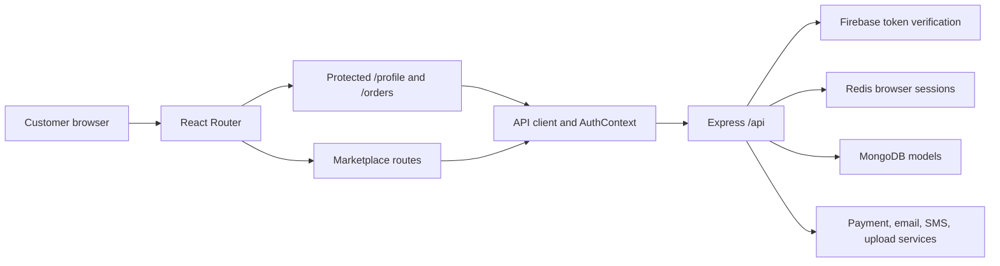
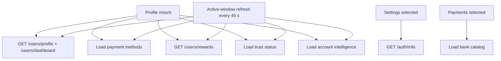

# Account and Profile Overhaul: Current Architecture

## System context

Aura is a multi-surface marketplace. The web account experience is a React/Vite client backed by an Express API. Firebase identity, server-issued browser sessions, Redis, MongoDB, payment providers, and deployment-specific trust controls all participate in account behavior.

## Frontend route ownership

`app/src/App.jsx` is the route composition root.

| Route or destination | Current owner | Protection |
|---|---|---|
| `/profile` | `pages/Profile/index.jsx` | `ProtectedRoute` |
| `/orders` | `pages/Orders/index.jsx` | `ProtectedRoute` |
| `/wishlist` | Separate wishlist page | Public route wrapper |
| `/my-listings` | Seller listing page | Seller route |
| `/trade-in` | Separate trade-in page | Route-level behavior outside Account Center |
| `/price-alerts` | Separate alert page | Route-level behavior outside Account Center |
| `/privacy`, `/terms` | Policy pages | Public |

The current navigation model is destination-oriented rather than a single account information architecture.

## Profile composition

`Profile/index.jsx` owns navigation, data loading, mutations, refresh behavior, message banners, and state for:

1. Overview
2. Personal information
3. Addresses
4. Orders
5. Rewards
6. Listings
7. Payments
8. Notifications
9. Support
10. Settings

The child components provide visual separation but do not create independent data boundaries. In particular:

- `SettingsSection.jsx` combines password recovery, linked providers, passkeys, TOTP, recovery codes, trusted devices, payment trust, notification toggles, policy links, and logout.
- `SupportSection.jsx` combines a large support command surface and ticket behavior.
- several sections still use legacy light utility styles that are remapped through global selectors in `app/src/styles.css`;
- section navigation is a horizontal button row without a complete tablist/tabpanel contract.

## Frontend data flow

This fan-out gives the page broad coupling and refreshes data unrelated to the active task. The server-state cache is implicit in component/context state rather than a dedicated query layer with explicit freshness and invalidation rules.

## Backend domain surfaces

| Domain | Route family | Primary responsibilities |
|---|---|---|
| Identity/session | `/api/auth` | Session sync/current/logout, MFA, TOTP, passkeys, trusted devices, recovery codes, Duo, desktop handoff |
| Profile | `/api/users` | Profile read/update, dashboard, rewards, seller activation, addresses, wishlist |
| Orders | `/api/orders` | History, detail, timeline, cancellation, refund/return/replacement/support/warranty commands |
| Payments | `/api/payments` | Saved methods and value-sensitive payment actions |
| Notifications | `/api/notifications` | Paginated history, unread counts, mark read |
| Support | `/api/support` | Tickets, messages, support operations |
| Marketplace | `/api/listings`, `/api/trade-in`, `/api/price-alerts` | Seller/customer marketplace activity |
| Uploads | `/api/uploads` and review-media paths | Upload/security pipelines for existing media domains |

The current shape is already a modular monolith at the route level. The overhaul should strengthen module contracts rather than introduce distributed services.

## Identity and session architecture

- Firebase credentials establish identity.
- Express middleware verifies the authenticated principal.
- Redis stores opaque browser-session records.
- Each user's session IDs are tracked in a Redis set, enabling bounded user- and device-scoped revocation.
- The public API exposes the current session and logout, but not a customer session inventory.
- Trusted-device and passkey records are embedded in the user security model and exposed through the MFA Security Center.
- Trusted devices are authentication credentials or recognition records; they are not equivalent to every active browser session.

## Data model

The `User` document currently embeds:

- profile fields;
- addresses;
- trusted devices;
- wishlist snapshots;
- loyalty state and ledger;
- recovery/security state.

Separate models exist for orders, listings, trade-ins, payment/support records, notifications, security events, and auth-security outbox work.

Relevant current indexes include:

- user identity and account-state indexes;
- notification indexes on `{ user, isRead, createdAt }` and `{ user, createdAt }`;
- support tickets on `{ user, lastMessageAt }`;
- trade-ins on `{ user, status }`;
- order history cursor ordering on user, creation time, and identifier.

Long-lived embedded arrays create document-growth risk and complicate retention or independently paginated history.

## Deployment boundary

The repository contains multi-host frontend, backend, gateway, desktop, and mobile workflows with explicit rollback lanes. The production command center requires manual confirmation and same-SHA gates. Main pushes run gates but do not authorize an automatic production mutation.

Because the audited local SHA is behind the observed live SHA, this checkout is not a valid production rollout source until it is reconciled.

## Architectural constraints for the target

1. Keep Express as the security and authorization boundary.
2. Keep auth/session/MFA/trusted-device contracts backward compatible while UI modules are separated.
3. Add customer session inventory using bounded Redis-set reads; never scan the global keyspace.
4. Separate query models from mutation commands and give each account module explicit loading/error/empty states.
5. Use cursor pagination for unbounded histories.
6. Move avatar/media payloads out of the user document through signed, server-authorized object-storage intents.
7. Keep legal retention workflows explicit; do not hard-delete payment, tax, fraud, or security evidence blindly.
8. Introduce versioned or additive response fields before removing legacy shapes.
