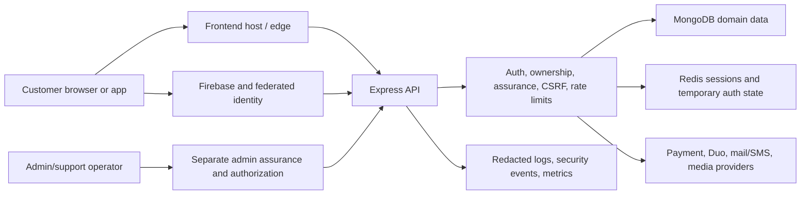

# Account and Profile Overhaul: Security Threat Model

## Status and review boundary

**Repository-grounded draft; product-policy assumptions remain unconfirmed.**

This threat model covers the customer Account Center, its existing domain integrations, the additive active-session API, and the trust boundaries that can change customer identity, commerce state, security posture, or privacy lifecycle. It is not a claim that every target capability is implemented or production-verified.

The threat-model assumption checkpoint requested confirmation of jurisdiction/retention rules, deletion grace/reactivation behavior, and export delivery. No concrete policy was supplied. Consequently:

- destructive export/deactivation/deletion endpoints are not implemented;
- this document treats real customer PII and commerce data as regulated/sensitive;
- the strictest safe behavior is required until policy owners approve exact lifecycle rules;
- production and migration gates remain closed.

## Scope

### Included

- React/Vite account and profile surfaces under `app/src/pages/Profile/`;
- Firebase-backed identity, server browser sessions, OTP, passkeys, TOTP, recovery, Duo/admin assurance, CSRF, DPoP, and trusted-device middleware;
- Express customer account, user, auth, order, payment, rewards, listing, trade-in, notification, and support boundaries;
- MongoDB customer/domain records and Redis browser-session state;
- avatar/profile media behavior and the target S3 pipeline;
- security telemetry and customer-safe activity projections;
- CI, release identity, secrets, and rollback requirements that protect these flows.

### Excluded from detailed analysis

- a complete AWS organization/IAM threat model;
- payment-provider internal systems;
- Firebase, Duo, Stripe, MongoDB, Redis, and hosting-provider internals beyond Aura's integration boundary;
- employee endpoint security and physical security;
- legal interpretation of retention or erasure obligations.

Those systems remain dependencies and may introduce residual risk.

## System model

## Trust boundaries

| Boundary | Untrusted input | Required enforcement |
|---|---|---|
| Browser to API | route, body, query, headers, cookies, bearer proof, upload | authentication, CSRF where cookie-authenticated, strict validation, limits, server-owned subject |
| Firebase/provider to API | signed claims and provider responses | issuer/signature/audience/time validation, identity normalization, replay/freshness policy |
| Session cookie to Redis | opaque cookie value | sender/session checks, TTL, user ownership, revocation, no public disclosure |
| API to MongoDB | normalized application data | allowlisted writes, ownership filters, concurrency/transaction policy, safe projections |
| API to payments/commerce providers | provider IDs and commands | server-calculated amount/eligibility, idempotency, verified callback/webhook |
| Customer to admin/support | appeals, tickets, attachments, account claims | separate admin authorization, no role inheritance from customer state |
| API to telemetry | errors, identities, security context | structured allowlists, pseudonymization, secret and query redaction |
| CI/deploy to runtime | artifacts, configuration, secrets | OIDC/least privilege, artifact identity, environment validation, rollback target |

## Assets

1. Identity bindings: Firebase UID, normalized email/phone, provider links, verification state.
2. Authentication material: browser sessions, CSRF state, DPoP keys, OTP/recovery grants, passkey metadata, MFA state.
3. Customer PII: names, addresses, phone, email, date of birth, avatar/media, support content.
4. Commerce ownership and eligibility: orders, returns, refunds, listings, trade-ins, reviews, rewards, entitlements.
5. Financial references: tokenized payment summaries, payout-provider references, refund and valuation state.
6. Privacy lifecycle: consent, export jobs, deactivation/deletion state, retention holds, audit evidence.
7. Administrative authority: roles, permissions, admin assurance, moderation and account-state actions.
8. Operational integrity: release artifacts, secrets, audit events, observability, migrations, backups, rollback targets.

## Attacker model

Consider:

- an unauthenticated internet attacker;
- an authenticated customer attacking another customer;
- an attacker with a stolen session cookie, bearer token, or compromised browser;
- an attacker able to submit malicious profile, address, support, listing, or media content;
- a malicious seller/customer manipulating business eligibility, value, ownership, or race timing;
- a low-privilege support/admin user attempting vertical escalation;
- an attacker who can trigger provider, Redis, database, network, or retry failure modes;
- dependency or build-chain compromise;
- accidental operator or migration error.

Do not assume the attacker can forge correctly validated provider signatures, break modern cryptography, directly read protected production datastores, or alter a trusted release artifact without separately compromising that boundary.

## Primary abuse cases and controls

| ID | Threat / attack path | Impact | Current evidence and disposition | Required validation or follow-up |
|---|---|---|---|---|
| AT-01 | Customer supplies another `userId`, order ID, listing owner, or address owner | Cross-user PII/commerce access | Existing protected routes generally derive subject from `req.user`; audit documents ownership-positive order/listing/payment paths | Keep negative cross-user integration tests for every new account projection and mutation |
| AT-02 | Extra JSON fields mutate role, account state, balances, assurance, or immutable identity | Privilege/value corruption | User writes use explicit allowlists; new session routes use strict Zod shapes | Reject unknown fields and test role/owner/price/assurance injection on every new contract |
| AT-03 | Stale or low-assurance session changes email, phone, recovery, passkeys, payout, deletion, or global session state | Account takeover | Existing fresh-auth, MFA, passkey, OTP, admin assurance, and action policy must be preserved; revoke-others uses `requireFreshMfa` | Add end-to-end challenge/resume coverage and ensure denial is never translated into success |
| AT-04 | Raw session ID leaks through API, URL, log, analytics, or DOM | Session theft/replay | Implemented projection returns a SHA-256 base64url alias plus allowlisted client/OS/timestamps; tests assert no raw session or identity proof | Add live response/log inspection in staging; do not add IP/raw user agent to customer responses |
| AT-05 | Public session alias is used to revoke another customer's session | Cross-user denial of service | Alias resolution occurs only after loading the authenticated user's Redis set; cross-user regression passes | Preserve non-enumerating 404 and server-owned user ID in controller/route tests |
| AT-06 | “Revoke others” removes current session, skips hidden sessions, or touches another user | Lockout or persistent stolen session | Current session comes from server request context; 101-session regression proves every other owned record is revoked while current and other users remain | Exercise real Redis and concurrent session creation in staging |
| AT-07 | Cross-site request triggers account/session mutation | Unauthorized state change | Cookie requests require CSRF; bearer-authenticated calls are exempt by existing policy; strict route coverage passes | Verify SameSite/secure cookie behavior and hostile-origin requests in staging |
| AT-08 | XSS from profile, address, support, listing, notification, or provider content steals authority | Account/PII compromise | React escapes text by default; rich-content and URL surfaces require separate sanitization | Audit every HTML/markdown renderer and URL sink; keep CSP and avoid bearer/session material in browser storage |
| AT-09 | Remembered browser is presented or accepted as MFA/admin assurance | Assurance downgrade | Current policy distinguishes recognition from MFA and maintains a separate admin policy; UI now separates credentials from active sessions | Preserve device proof -> MFA -> authorization ordering and physical/synced passkey language |
| AT-10 | Redis unavailable and security controls silently fall back in production | Unlimited abuse or inconsistent sessions | New account-session limiter is security-critical and has no in-memory production fallback; session service has explicit availability policy | Run Redis-unavailable integration/staging exercise and verify 503/fail-closed behavior |
| AT-11 | Cache key or stale cache serves one customer's data to another | PII/commerce leakage | Existing caches require continued subject binding; account target requires subject-scoped query keys | Add two-user cache isolation tests before summary/query-layer rollout |
| AT-12 | Client chooses return eligibility, refund, price, reward, valuation, or payout target | Financial abuse | Existing commerce services are intended to calculate authority server-side | Add tampering, replay, idempotency, and concurrency tests per visible self-service action |
| AT-13 | Embedded addresses, trusted devices, wishlist, or history grows without bound | Document/latency denial of service | Audit found embedded-array growth risk; no schema migration was introduced in this wave | Measure cardinality/query plans, then migrate with bounded, resumable compatibility reads |
| AT-14 | Base64 avatar or malicious media causes document bloat, active content, or storage abuse | Availability/XSS/cost | Current backend validates narrow image formats but persists avatar data in the user record | Replace only after signed-upload, magic-byte, size/dimension, metadata, ownership, scan, and cleanup controls exist |
| AT-15 | Sensitive errors, provider data, PII, tokens, queries, or assurance proofs enter logs | Credential/PII exposure | New session telemetry records only event/outcome and safe counts/booleans; new inventory warnings omit user ID | Run secret/log redaction scans and inspect staging events before rollout |
| AT-16 | Privacy export/deletion is replayed, races an order/refund/hold, or deletes too much/little | Irrecoverable loss or legal breach | Target contracts and migration plan exist; destructive implementation intentionally blocked | Approve jurisdiction, retention, hold precedence, grace/reactivation, export delivery/expiry, audit, and rollback policy first |
| AT-17 | Customer account state is confused with administrator permission or assurance | Vertical privilege escalation | Admin authorization and assurance are distinct existing controls and must remain fail-closed | Test customer MFA cannot satisfy admin policy; test final required admin factor cannot be removed |
| AT-18 | Build/deploy points frontend and backend at different releases or weakens environment controls | Auth outage or security regression | Rollout documents require exact SHA, health/release markers, scoped targets, and rollback | Do not deploy until CI, staging, branch protection, cost, observability, migration, and rollback gates pass |

## Implemented session-security properties

The additive active-session capability has the following current properties:

- `protect` derives the customer from the verified principal.
- Inventory reads the authenticated user's Redis session set; it does not scan the global session namespace.
- Results are bounded to 20 public rows and inspect at most 100 rows for display/alias lookup.
- “Revoke others” processes the complete per-user tracked set rather than the display cap.
- A one-way 43-character alias is exposed instead of the raw cookie/session identifier.
- Only client family, OS family, created/last-active/expiry timestamps, and current flag are serialized.
- Raw user agent, IP, location, token, device ID, Firebase UID, AMR, and assurance proof are excluded.
- Target revocation rechecks record ownership.
- Current-session identity comes from server session context; clearing the current cookie is server-owned.
- Mutation routes are authenticated, rate-limited, and CSRF-protected for cookie sessions.
- Revoke-others additionally requires fresh MFA/action policy.
- Telemetry contains an allowlisted event name, outcome, reason, surface, and safe boolean/count.

These properties are supported by focused unit/controller tests and static route-enforcement checks. They have not been exercised against production or a live staging Redis instance.

## Privacy decisions required before implementation

Policy owners must confirm:

1. governing jurisdictions and age/minor-account requirements;
2. export scope, format, generation SLA, encrypted delivery, authentication, expiry, and download audit;
3. deactivation semantics versus deletion;
4. deletion grace period and whether/how reactivation cancels it;
5. order, tax, payment, fraud, chargeback, warranty, dispute, support, and legal-hold precedence;
6. anonymization versus erasure per collection/provider;
7. backup and log retention;
8. notification requirements;
9. admin/support authority and dual-control needs;
10. failure recovery when background deletion partially completes.

Until approved, UI may explain that controls are unavailable, but it must not expose inert destructive buttons or simulate successful requests.

## Security verification gates

- Focused auth/session/controller tests pass.
- Strict sensitive-route coverage passes.
- Cross-user negative tests exist for every new owner-scoped endpoint.
- Unknown-field/mass-assignment tests exist for every mutation.
- Redis unavailable, Mongo unavailable, and provider failure behavior is safe.
- CSRF and hostile-origin tests pass for cookie mutations.
- Fresh-assurance challenges pass and stale assurance fails.
- Logs and client payloads are inspected for raw session/PII/token leakage.
- Authenticated keyboard/mobile browser flows pass.
- Exact release SHA passes CI, staging, observability, rollback, and smoke gates.

## Residual risk

- The current Profile component remains a compatibility orchestrator with broad domain state.
- Active-session display is capped and not cursor-paginated; the complete tracked set is still used for revoke-others.
- Client/OS classification is intentionally coarse and can be inaccurate because the user agent is attacker-controlled display metadata.
- Real Redis concurrency/unavailability and live revocation have not been tested in this branch.
- Customer-safe security activity, global session revocation, privacy lifecycle, signed avatar uploads, and schema migration are target work, not current functionality.
- Dependency audits contain unresolved findings recorded in the baseline.
- Production and live account verification are not authorized and were not performed.

## Review cadence

Re-review this model when:

- a new account mutation or data source is exposed;
- identity, session, MFA, passkey, admin, payment, payout, upload, privacy, or migration behavior changes;
- policy decisions above are approved;
- a new provider or trust boundary is introduced;
- staging reveals a different topology or data flow;
- a security incident or abuse pattern invalidates an assumption.
