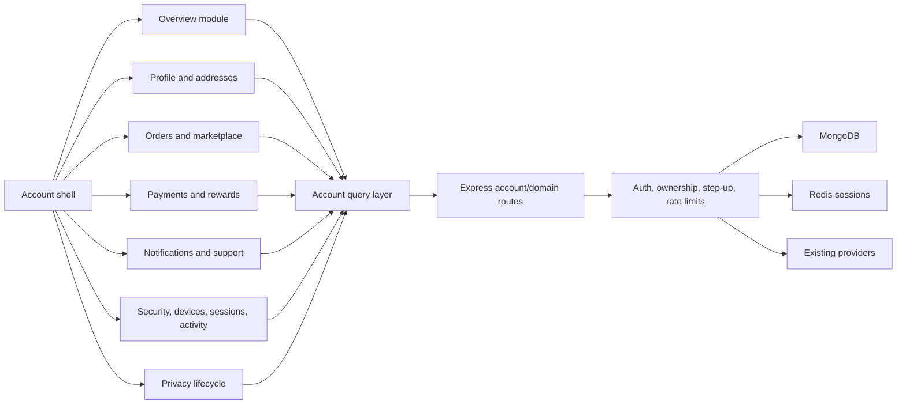
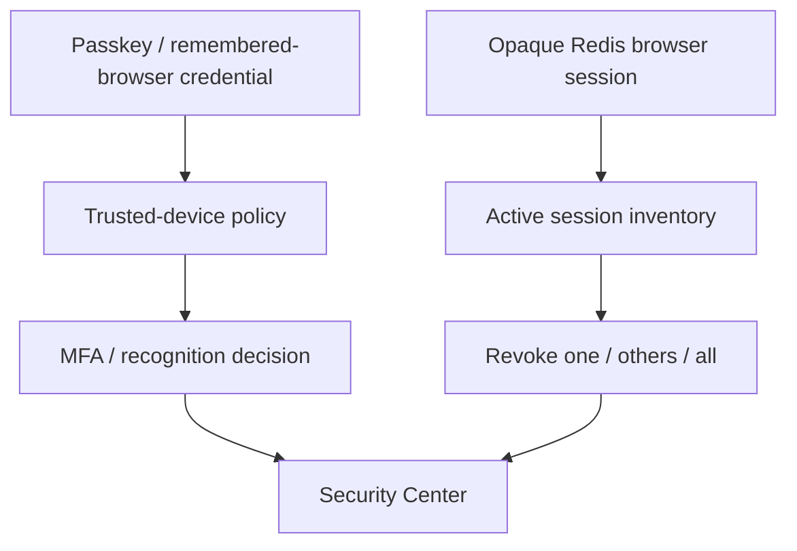

# Account and Profile Overhaul: Target Architecture

## Target shape

The target remains a modular monolith: one React application, one Express API, MongoDB for durable records, Redis for browser sessions and bounded ephemeral state, and existing provider integrations. The work reorganizes responsibilities and adds missing contracts; it does not introduce network services without a measured need.



## Frontend module structure

Target source ownership:

```text
app/src/features/account/
  routes/
    AccountLayout.jsx
    AccountOverviewRoute.jsx
    ProfileRoute.jsx
    AddressesRoute.jsx
    OrdersRoute.jsx
    PaymentsRoute.jsx
    RewardsRoute.jsx
    NotificationsRoute.jsx
    SecurityRoute.jsx
    MarketplaceRoute.jsx
    SupportRoute.jsx
    PrivacyRoute.jsx
  components/
    AccountRail.jsx
    AccountMobileNav.jsx
    AccountPageHeader.jsx
    AccountStatus.jsx
    AccountEmptyState.jsx
    AccountErrorState.jsx
    AccountConfirmDialog.jsx
  data/
    accountQueryKeys.js
    accountQueries.js
    accountMutations.js
    accountSchemas.js
  modules/
    profile/
    addresses/
    orders/
    payments/
    rewards/
    notifications/
    security/
    marketplace/
    support/
    privacy/
  styles/
    account-tokens.css
    account-shell.css
```

The existing `/profile` path should initially redirect or render the new `/account/overview` module without breaking bookmarks. Existing `/orders`, `/wishlist`, and marketplace paths remain valid during transition and can progressively share the new module components.

## Server-state strategy

Adopt a dedicated query layer with:

- stable query keys per account domain and authenticated subject;
- request deduplication;
- abort signals for navigation and superseded searches;
- bounded stale times per data sensitivity;
- mutation-driven invalidation;
- no periodic refresh for inactive modules;
- retry only for safe idempotent reads;
- no automatic retry for account, payment, security, or privacy mutations;
- explicit offline/stale presentation.

TanStack Query is the preferred implementation if package-level audit and React 19 compatibility checks pass. If adding it would worsen the security or dependency gate, the equivalent must be implemented with the existing Zustand/runtime primitives and the same testable semantics. A bespoke cache without cancellation, invalidation, and error isolation is not acceptable.

Suggested freshness:

| Data | Stale window | Background refresh |
|---|---:|---|
| Current profile/addresses | 5 minutes | On focus after stale |
| Order summaries | 60 seconds | On module focus |
| Payment methods | 60 seconds | On module focus; never cache sensitive provider payloads |
| Rewards | 2 minutes | On module focus |
| Notifications | 30 seconds | On module focus or explicit polling when visible |
| MFA/trusted devices | 0–30 seconds | Only inside Security |
| Active sessions | 0–30 seconds | Only inside Security |
| Privacy job state | 10 seconds while active | Stop at terminal state |

## Backend modules

Keep existing route families authoritative and add an account composition layer only where it reduces network fan-out without duplicating policy:

```text
server/modules/account/
  accountSummaryService.js
  accountSessionService.js
  accountActivityService.js
  accountPreferenceService.js
  accountPrivacyService.js
  accountValidators.js
  accountSerializers.js
```

Controllers must remain thin. Domain services own transactions and state transitions. Serializers expose explicit public projections rather than raw Mongoose documents.

## Summary endpoint decision

An additive `GET /api/account/summary` is justified for the first account paint because the current overview performs several independent reads. It may include only bounded, display-ready summaries:

- profile completion and account state;
- recent order summary, not full order history;
- unread notification count;
- rewards balance;
- saved-payment count and safe brand/last-four summary only;
- one server-derived security recommendation;
- marketplace counts.

It must not contain passkey credential IDs, session tokens, full addresses, payment provider payloads, raw security events, or large embedded collections. Each field is independently optional so one failed non-critical source can produce a partial response instead of failing the whole page.

## Session and device separation



- Credential inventory comes from the existing MFA/trusted-device service.
- Active sessions come from the per-user Redis session set.
- The implemented public session serializer returns an opaque one-way session alias, client family, OS family, created/last-active/expiry timestamps, and a server-derived current-session flag. Coarse location and customer-safe risk language remain optional future fields and must not be inferred from raw client data.
- It never returns the cookie value, raw session ID, tokens, IP address, full user agent, device fingerprint, or internal assurance secrets.
- Revocation reuses existing server primitives and derives the user from `req.user`.

## Data boundaries

- Profile and addresses remain readable from legacy user documents during migration.
- New avatar media stores only an object key and safe derived variants on the user.
- Notification preferences become a bounded, versioned subdocument or dedicated record.
- Security activity is a redacted projection built from allowlisted event types.
- Export and deletion jobs use dedicated state records and append-only audit evidence.
- Unbounded histories use cursor pagination and stable compound indexes.

## Compatibility and rollout

1. Add new serializers/endpoints without removing old fields.
2. Ship the new shell behind `ACCOUNT_CENTER_V2`.
3. Migrate modules one at a time while old routes remain reachable.
4. Compare request/error/latency and task-completion signals.
5. Make `/profile` route to the new overview only after parity evidence.
6. Remove legacy orchestration and global CSS overrides only after the flag is fully enabled and rollback no longer depends on them.
