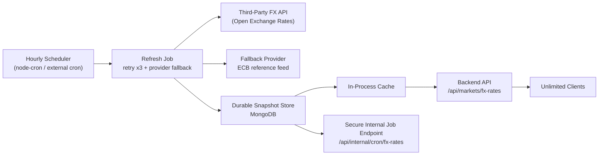

# FX Rate Pipeline

## 1. System Architecture

### Explanation
- User traffic never calls the provider directly. All frontend and checkout reads use the backend cache only.
- The scheduler refreshes rates every hour with the cron expression `0 * * * *`.
- The refresh job uses a Mongo-backed distributed lock so multiple backend instances still make only one upstream call per cycle.
- The last successful snapshot is stored durably in MongoDB and copied into in-process memory for low-latency reads.
- If the primary provider fails or hits quota, the service falls back to ECB and, if needed, to the last known good snapshot.

## 2. Full Code

### Key Files
- Scheduler + provider + cache + fallback logic: [`server/services/payments/fxRateService.js`](/c:/Users/mdsai/Downloads/Kimi_Agent_Flipkart-Style Frontend/server/services/payments/fxRateService.js)
- Durable snapshot model: [`server/models/FxRateSnapshot.js`](/c:/Users/mdsai/Downloads/Kimi_Agent_Flipkart-Style Frontend/server/models/FxRateSnapshot.js)
- Public cached read endpoint: [`server/controllers/marketController.js`](/c:/Users/mdsai/Downloads/Kimi_Agent_Flipkart-Style Frontend/server/controllers/marketController.js)
- Secure cron endpoint: [`server/routes/internalOpsRoutes.js`](/c:/Users/mdsai/Downloads/Kimi_Agent_Flipkart-Style Frontend/server/routes/internalOpsRoutes.js)
- One-shot cron/script entrypoint: [`server/scripts/refresh_fx_rates.js`](/c:/Users/mdsai/Downloads/Kimi_Agent_Flipkart-Style Frontend/server/scripts/refresh_fx_rates.js)
- Startup wiring: [`server/index.js`](/c:/Users/mdsai/Downloads/Kimi_Agent_Flipkart-Style Frontend/server/index.js)

## 3. Setup Instructions

1. Copy [`server/.env.example`](/c:/Users/mdsai/Downloads/Kimi_Agent_Flipkart-Style Frontend/server/.env.example) to `server/.env`.
2. Set `OPEN_EXCHANGE_RATES_APP_ID`.
3. Keep `PAYMENT_FX_SCHEDULER_ENABLED=true`.
4. Keep `PAYMENT_FX_REFRESH_CRON=0 * * * *`.
5. Keep `PAYMENT_FX_REFRESH_RETRY_ATTEMPTS=3`.
6. Set `PAYMENT_FX_MAX_CALLS_PER_DAY` to match your provider plan.
7. If you use external cron, also set `CRON_SECRET`.
8. Start the backend with `cd server && npm start`.
9. Optional warm-up: `cd server && npm run fx:refresh`.

## 4. Deployment Guide

### Local Machine
- Run the Express server normally.
- `node-cron` runs inside the process every hour.
- Rates are stored in MongoDB, so restarts keep the last successful snapshot.

### AWS
- Best fit: ECS, EC2, or App Runner for the long-lived backend so the built-in `node-cron` scheduler runs continuously.
- If you want AWS Lambda, use EventBridge Scheduler to hit `GET /api/internal/cron/fx-rates` on your backend with `Authorization: Bearer $CRON_SECRET`.
- You can also package `server/scripts/refresh_fx_rates.js` into a separate job/container if you prefer isolated cron workers.

### Vercel Cron
- Keep the backend on a long-lived service.
- Configure Vercel Cron to call `GET https://<backend-host>/api/internal/cron/fx-rates`.
- Send `Authorization: Bearer <CRON_SECRET>`.
- Do not rely on in-request refreshes from frontend traffic.

### GCP Scheduler
- Use Cloud Scheduler with an hourly HTTP target pointing to `GET /api/internal/cron/fx-rates`.
- Add the `Authorization: Bearer <CRON_SECRET>` header.
- Keep the Express backend on Cloud Run, GKE, Compute Engine, or another always-on runtime.

## 5. Scaling Strategy

- Horizontal scaling: safe because the refresh job uses a Mongo-backed lock.
- Unlimited reads: client requests are served from memory or the persisted snapshot, not from the provider.
- Cost control: `PAYMENT_FX_MAX_CALLS_PER_DAY` prevents a failing paid provider from burning through the free tier.
- Reliability: the system falls back in this order: primary provider -> ECB -> last successful snapshot.
- Extensibility: add more providers by extending the provider sequence in [`server/services/payments/fxRateService.js`](/c:/Users/mdsai/Downloads/Kimi_Agent_Flipkart-Style Frontend/server/services/payments/fxRateService.js).

## 6. Common Mistakes To Avoid

- Do not call the FX provider from the frontend.
- Do not use user requests to trigger upstream refreshes.
- Do not store the API key in source control or expose it to the browser.
- Do not skip the durable snapshot store; in-memory cache alone loses fallback data on restart.
- Do not run multiple schedulers without a distributed lock.
- Do not leave `PAYMENT_FX_MAX_CALLS_PER_DAY` higher than your provider plan.
