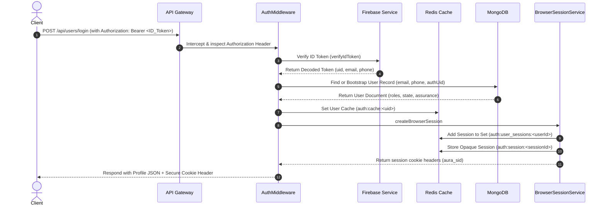
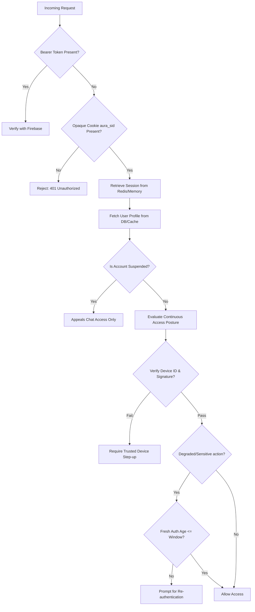

# Login Architecture Map & Flow Sequence

This document maps the complete authentication and session management architecture of the Aura Marketplace, detailing the sequence of operations from the client through security layers, external identity provider (Firebase), cache (Redis), and primary database (MongoDB).

## 1. Sequence Diagram: Authentication Flow

Below is the execution flow when a client authenticates via a Firebase token (OAuth or Password) and establishes a stateful, secure browser session.

---

## 2. Dynamic Posture & Continuous Access Policy (CAP)

The Aura auth system enforces a dynamic security posture check on every protected commercial API route.

---

## 3. Component Architecture Matrix

| Layer / Component | Technology | Role | Scalability / Performance Characteristics |
| :--- | :--- | :--- | :--- |
| **Identity Provider** | Firebase Auth | External Auth & Social Federated Sign-in | Bypasses core password-hashing CPU load on API server. Subject to external API latency and rate-limits. |
| **API Gateway / Router** | Express.js | Traffic orchestration, validation, error boundary | Runs statelessly, scales horizontally. Handles gzip, rate-limiting, and schema validation. |
| **Cache & Distributed Store** | Redis | Session state, token invalidation caches, distributed rate limits | Memory-bound, sub-millisecond lookups. Key lookup is $O(1)$, Set-based tracking replaces expensive scans. |
| **Database** | MongoDB | Persistent user profiles, trusted device registries, transactional audit logs | Disk/Memory-bound. Relies heavily on indexes (`email`, `phone`, `authUid`) for low-latency lookups. |

---

## 4. Key Security Boundaries

1. **Opaque Browser Session Cookie (`aura_sid`)**: Hardened with `HttpOnly`, `Secure`, and context-aware `SameSite` flags (automatically falls back to `SameSite=None` when API domain differs from frontend domain).
2. **Cryptographic Device Binding**: Enforces hardware/browser key assertion verification for high-risk operations or elevated risk state profiles.
3. **Emergency Disables**: Uses global memory flags (`DISABLE_SIGNUP`, etc.) to instantly lock down routes when malicious vectors are detected.
