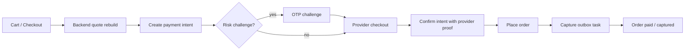

# Payment Architecture

This document maps what is present in the payment system today and separates backend/API capability from the features that are visible in the React frontend.

## Current Scope

The payment stack is built around provider-backed digital payment intents plus COD fallback. Razorpay remains the default live provider; Stripe is now implemented as an opt-in card provider.

- Shopper checkout supports `COD`, `UPI`, `CARD`, `WALLET`, and `NETBANKING` as selectable methods.
- Digital methods create a server payment intent before opening Razorpay Checkout or Stripe Payment Element.
- Orders are still server-authoritative: totals are recomputed and the payment intent is validated before order commit.
- Admin users have payment operations screens for intent review, capture, refunds, stale intent cleanup, and refund ledger reconciliation.
- Background workers handle post-order capture and retryable refund/capture tasks.

## Feature Coverage

| Capability | Backend/API | Shopper frontend | Admin frontend | Notes |
| --- | --- | --- | --- | --- |
| COD checkout | Present | Present | Order-facing only | COD bypasses payment intents. |
| Razorpay digital checkout | Present | Present | Visible through intent detail | Frontend loads Razorpay Checkout from `app/src/utils/razorpay.js`. |
| Stripe card checkout | Present as opt-in provider | Present for card via Stripe Payment Element | Visible through intent detail | Requires `PAYMENT_PROVIDER=stripe` or dynamic Stripe routing plus Stripe keys. |
| UPI, card, wallet, netbanking methods | Present | Present | Filterable in admin payment views | Digital intent creation only accepts these digital methods. |
| Netbanking bank catalog | Present | Present | Visible through bank/rail context | Checkout fetches supported banks and lets users select a bank. |
| Payment capabilities catalog | Present | Partially present | Present in ops overview | Checkout shows rail/capability summaries, but not every backend detail. |
| Market country and charge currency | Present | Present for card checkout | Present in ops metrics | Backend enforces rail/currency/country rules. |
| FX quote and settlement lock | Present | Partially present | Present | Shopper sees charge/settlement hints; backend owns exact lock and validation. |
| Risk scoring | Present | Partially present | Present | Shopper sees risk decision/status, not full factor detail. |
| OTP payment challenge | Present | Present | Present in timelines | High-risk intents can require OTP before Razorpay confirmation. |
| Idempotency keys | Present | Present through API client | Present through API client | Critical mutations use idempotency headers. |
| Webhook verification and dedupe | Present | Not applicable | Events visible in admin detail | Webhooks are backend-only by design. |
| Post-order capture outbox | Present | Not exposed | Present | Shopper only sees resulting payment/order state. |
| Refund creation | Present | Present through order refund flows | Present | Admin also supports direct refund from payment detail. |
| Refund ledger reconciliation | Present | Not exposed | Present | Admin-only operational surface. |
| Saved payment methods list | Present | Present | Not central | Checkout reads methods; profile lists them. |
| Saved method default/delete | Present | Present in profile | Not central | Profile can set default and delete saved methods. |
| Saved method enrollment | Present | Present after successful digital checkout and profile add flow | Not central | `confirmPaymentIntent` auto-upserts tokenized provider methods; Profile can add Stripe cards through SetupIntents and save Razorpay netbanking bank preferences. |
| Saved Stripe card reuse | Present | Present | Not central | Checkout routes saved Stripe cards back to Stripe, confirms the saved `pm_...`, and handles required Stripe actions before backend confirmation. |
| Saved Razorpay method reuse | Present | Present | Not central | Checkout uses Razorpay display configuration to land saved UPI, wallet, and netbanking choices on the matching method/instrument. Razorpay card reuse requires a customer id. |
| Dynamic provider routing | Present as router abstraction | Provider scope note | Present in provider overview | Stripe routing is opt-in with `PAYMENT_STRIPE_ROUTING_ENABLED=true`; Razorpay remains the default route. |
| PayPal provider | Not present | Not present | Not present | The docs should not claim PayPal is implemented. |

## Main Flow



## Important Backend Files

- Payment flags and production guardrails: `server/config/paymentFlags.js`
- Payment routes: `server/routes/paymentRoutes.js`
- Admin payment routes: `server/routes/adminPaymentRoutes.js`
- Payment controller: `server/controllers/paymentController.js`
- Payment service: `server/services/payments/paymentService.js`
- Razorpay provider: `server/services/payments/providers/razorpayProvider.js`
- Stripe provider: `server/services/payments/providers/stripeProvider.js`
- Provider factory/router: `server/services/payments/providerFactory.js`, `server/services/payments/paymentRouter.js`
- Risk engine: `server/services/payments/riskEngine.js`
- Idempotency service: `server/services/payments/idempotencyService.js`
- Refund state: `server/services/payments/refundState.js`
- Payment outbox state: `server/services/payments/outboxState.js`
- FX service: `server/services/payments/fxRateService.js`
- Payment models: `server/models/PaymentIntent.js`, `server/models/PaymentMethod.js`, `server/models/PaymentEvent.js`, `server/models/PaymentOutboxTask.js`

## Important Frontend Files

- Checkout orchestration: `app/src/pages/Checkout/index.jsx`
- Payment step UI: `app/src/pages/Checkout/components/StepPayment.jsx`
- Razorpay script loader: `app/src/utils/razorpay.js`
- Stripe script loader: `app/src/utils/stripe.js`
- Payment API client: `app/src/services/api/paymentApi.js`
- Admin payment console: `app/src/pages/Admin/Payments.jsx`
- Admin refund ledger: `app/src/pages/Admin/RefundLedger.jsx`
- Profile saved methods panel: `app/src/pages/Profile/components/PaymentsSection.jsx`

## Runtime Flags

Payment behavior is controlled by environment flags in `server/config/paymentFlags.js`.

- `PAYMENTS_ENABLED`
- `PAYMENT_PROVIDER`
- `PAYMENT_RISK_MODE`
- `PAYMENT_CAPTURE_MODE`
- `PAYMENT_SAVED_METHODS_ENABLED`
- `PAYMENT_REFUNDS_ENABLED`
- `PAYMENT_CHALLENGE_ENABLED`
- `PAYMENT_DYNAMIC_ROUTING_ENABLED`
- `PAYMENT_WEBHOOKS_ENABLED`
- `PAYMENT_STRIPE_ROUTING_ENABLED`
- `STRIPE_SECRET_KEY`
- `STRIPE_PUBLISHABLE_KEY`
- `STRIPE_WEBHOOK_SECRET`
- `STRIPE_API_VERSION`

Production requires credentials for the enabled provider and, when challenge mode is enabled, `OTP_CHALLENGE_SECRET`. Stripe defaults to API version `2026-02-25.clover` unless `STRIPE_API_VERSION` is set.

## Frontend Exposure Added

The shopper frontend now surfaces more of the backend payment behavior without pretending a second gateway is live.

- Checkout refreshes saved payment methods after a successful provider authorization.
- Checkout carries the returned `providerMethod` snapshot in local payment state.
- Checkout shows an empty method-vault state before the first saved method exists.
- Checkout payment state can show the saved/tokenized method returned by the backend.
- Profile saved-method copy shows provider/token/bank details when present.
- Provider-routing copy now reflects the active provider.
- Checkout can open Stripe Payment Element when the backend returns a Stripe checkout payload.
- Checkout can quick-confirm selected saved Stripe cards and shows a Quick Pay chip for those saved methods.
- Checkout can launch Razorpay with saved UPI, wallet, and netbanking preferences highlighted as the preferred provider path.
- Orders now include a shopper-facing Payment Timeline beside the broader trust timeline.
- Profile payments now shows recent order payment activity with method, provider routing, payment state, amount, intent id, and refund signal.
- Profile payments now supports manual add flows: Stripe card setup and Razorpay netbanking bank preference.

## Remaining Frontend Gaps

These are the main places where backend capability is ahead of frontend exposure:

1. Stripe currently supports the `CARD` rail only. UPI, wallet, and netbanking still use Razorpay.
2. Shopper-facing payment timelines are intentionally summarized. Raw webhook metrics and outbox health remain admin-only.
3. Webhook, outbox, and stale-intent cleanup are intentionally backend/admin concerns, not shopper UI features.
4. Saved Razorpay card reuse needs a Razorpay customer id; without it, checkout can only land on the card rail.

## Stripe Provider

Stripe is available as a second provider for card checkout.

1. Set `PAYMENT_PROVIDER=stripe` for static Stripe card checkout, or keep `PAYMENT_PROVIDER=razorpay` and set `PAYMENT_STRIPE_ROUTING_ENABLED=true` to allow dynamic routing to Stripe.
2. Configure `STRIPE_SECRET_KEY`, `STRIPE_PUBLISHABLE_KEY`, and `STRIPE_WEBHOOK_SECRET`.
3. Register the webhook endpoint `/api/payments/webhooks/stripe` for required Stripe PaymentIntent events.
4. Profile card enrollment uses Stripe SetupIntents through `/api/payments/methods/setup-intent`.
5. Keep Razorpay configured for UPI, wallet, and netbanking rails.

## Verification

Focused payment verification should start with:

```powershell
npm --prefix server test -- --runTestsByPath tests/paymentIntentCreateCartQuote.test.js tests/paymentOrderIntegrity.test.js tests/paymentSecurityGuards.test.js tests/paymentWebhookTransitionGuards.test.js tests/paymentOperationsService.test.js
```

On Windows PowerShell, if script execution policy blocks `npm.ps1`, use:

```powershell
npm.cmd --prefix server test -- --runTestsByPath tests/paymentIntentCreateCartQuote.test.js tests/paymentOrderIntegrity.test.js tests/paymentSecurityGuards.test.js tests/paymentWebhookTransitionGuards.test.js tests/paymentOperationsService.test.js
```

Broaden to the rest of the payment tests before changing production payment behavior.
