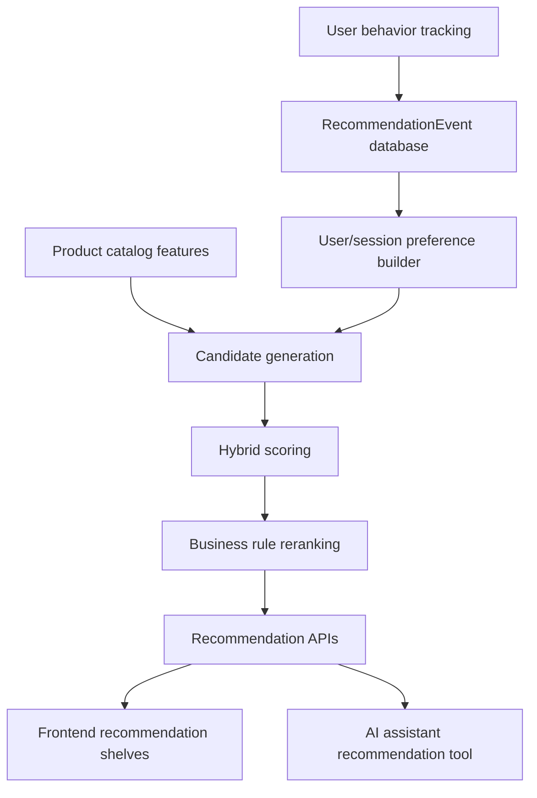

# Hybrid Recommendation System

## Overview
Aura now has two AI layers:

1. **AI E-commerce Assistant**: a conversational layer for product search, Q&A, comparison, buying guidance, policy answers, and action handoffs.
2. **Hybrid Recommendation Engine**: a silent intelligence layer that ranks products from behavior, content similarity, popularity, cart context, purchase patterns, and catalog quality.

The assistant can call the recommendation engine as a backend tool instead of guessing products from language alone.

## Why It Was Added
The assistant helps users when they ask. The recommendation engine helps even when they do not ask:

- Home: recommended for you and trending products.
- Product details: similar products, frequently bought together, and recently viewed recommendations.
- Cart: complete your cart and add-on suggestions.
- Search: products related to search intent.
- Assistant: catalog-backed product suggestions with human-friendly reasons.

## Architecture


## Data Flow
Frontend interactions send best-effort events to `POST /api/recommendation-events`. Signed-in users attach `userId` through optional auth. Guest users attach a `sessionId` stored in localStorage.

Tracked signals include product views, searches, category clicks, cart changes, wishlist changes, purchases, recommendation impressions/clicks, and assistant recommendation requests.

## Database Model
`RecommendationEvent` stores:

- `userId`
- `sessionId`
- `productId`
- `productNumericId`
- `eventType`
- `searchQuery`
- `category`
- `sourcePage`
- `recommendationSource`
- `metadata`
- `createdAt`

Indexes cover user/session history, product event lookup, event recency, and page recency.

## APIs
- `POST /api/recommendation-events`
- `GET /api/recommendations/home?limit=12`
- `GET /api/recommendations/similar/:productId?limit=8`
- `POST /api/recommendations/cart`
- `GET /api/recommendations/trending?limit=12`
- `GET /api/recommendations/recently-viewed?limit=8`
- `GET /api/recommendations/search?query=phone&limit=8`
- `GET /api/recommendations/frequently-bought/:productId?limit=6`
- `POST /api/recommendations/assistant`
- `GET /api/recommendations/debug`

Standard response:

```json
{
  "success": true,
  "type": "recommended_for_you",
  "count": 8,
  "recommendations": [
    {
      "product": {},
      "score": 82.5,
      "reason": "Because you viewed similar products",
      "source": "content_based"
    }
  ]
}
```

## Scoring Formula
The hybrid score is:

```text
finalScore =
  0.30 * contentSimilarityScore
+ 0.25 * userPreferenceScore
+ 0.15 * collaborativeScore
+ 0.10 * popularityScore
+ 0.10 * ratingScore
+ 0.05 * discountScore
+ 0.05 * freshnessScore
- penaltyScore
```

Penalties remove or reduce products already in cart, out-of-stock items, inactive items, same product duplicates, recently purchased items, and repetitive brand/category overload.

## Candidate Sources
- Content-based similar products.
- Trending products from weighted recent events.
- Recently viewed-based recommendations.
- Cart add-ons and accessories.
- Frequently bought together from order co-occurrence.
- Personalized candidates from category, brand, tag, price, cart, wishlist, purchase, and search signals.

## Cold Start
New users and guest sessions fall back to trending, top-rated, new, discounted, and broadly popular products. New products can still appear through category, brand, tag, price, and freshness boosts.

## Assistant Integration
The assistant now uses `getRecommendationsForAssistant({ userId, sessionId, message, currentProductId, cartItems, limit })` for recommendation-style requests. It detects budgets, categories, current product context, and cart context, then returns products with reasons the assistant can explain naturally.

Examples:

- “Suggest best products for me” uses home recommendations.
- “What should I buy with this phone?” uses current product and cart add-on candidates.
- “Best laptop under 50000” uses search intent plus recommendation scoring and budget filtering.

## Viva Explanation
Our project contains two AI layers. The first layer is the AI E-commerce Assistant, which interacts with users through natural language and helps them search, compare, and understand products. The second layer is the Hybrid Recommendation Engine, which silently analyzes user behavior, product similarity, popularity, cart activity, and purchase patterns to recommend relevant products. The assistant can also use the recommendation engine as a tool, so both systems work together instead of being separate features.

## Testing
Backend focused tests:

```powershell
npm --prefix server test -- --runTestsByPath tests/recommendationRoutes.test.js
```

Frontend build:

```powershell
npm --prefix app run build
```

Manual smoke:

1. Open home and confirm “Recommended for You” and “Trending Items” populate.
2. Open a product detail page and confirm similar, bought-together, and recently viewed sections render.
3. Add a product to cart and confirm “Complete Your Cart” excludes that product.
4. Search for `phone` and confirm related search recommendations render.
5. Ask the assistant “suggest best phone under 30000” and confirm it returns catalog-backed products.

## Future Improvements
1. Vector embeddings for product descriptions
2. Matrix factorization
3. Two-tower recommendation model
4. Deep learning ranking model
5. Redis caching
6. Real-time event streaming
7. A/B testing
8. Personalized offer ranking
9. Voice shopping assistant
10. RAG-based policy and product assistant
11. Admin analytics dashboard
12. Multi-language shopping assistant
