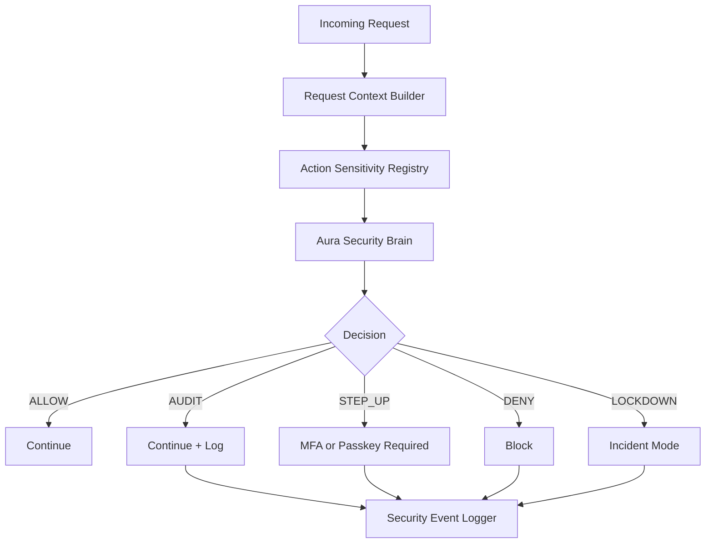

# Aura Nuclear Umbrella Security Fabric

The Aura Nuclear Umbrella Security Fabric is a central, reusable defensive control plane for sensitive requests. It does not replace Firebase/Auth, existing admin checks, payment verification, upload validation, rate limits, or existing sensitive-action middleware. It layers over those controls and defaults to audit-only behavior.

## Architecture

## Request Flow

1. Route middleware calls `requireSecurityDecision(action, options)`.
2. `requestSecurityContext.js` extracts a normalized context without raw tokens, passwords, OTPs, cookies, card data, IPs, or user agents.
3. `actionSensitivityRegistry.js` loads the action model.
4. `auraSecurityBrain.js` calls deterministic local risk scoring.
5. `securityEventLogger.js` logs redacted structured telemetry when audit is required.
6. Middleware continues in audit-only mode, or blocks only when enforcement flags are explicitly enabled.

## Decisions

- `ALLOW`: low risk, continue.
- `AUDIT`: continue and log.
- `STEP_UP`: require fresh MFA/passkey in enforcement mode.
- `DENY`: return 403 in enforcement mode.
- `LOCKDOWN`: return 423 for the action in enforcement mode and feed incident mode.

## Feature Flags

- `AURA_SECURITY_FABRIC_ENABLED`: enables the fabric.
- `AURA_SECURITY_FABRIC_AUDIT_ONLY`: defaults true; prevents blocking.
- `AURA_SECURITY_FABRIC_ENFORCE`: enables fabric enforcement only when audit-only is false.
- `AURA_SECURITY_BRAIN_ENABLED`: enables risk scoring.
- `AURA_SECURITY_BRAIN_ENFORCE`: allows brain decisions to block when fabric enforcement is on.
- `AURA_SENSITIVE_ACTION_STEP_UP_ENABLED`: reserved for deeper step-up integration.
- `AURA_INCIDENT_MODE_ENABLED`: enables incident-mode awareness.
- `AURA_INCIDENT_MODE_ENFORCE`: reserved for manual lockdown enforcement.
- `AURA_TENANT_GUARD_ENFORCE`: blocks tenant mismatch only when audit-only is false.
- `AURA_SECURITY_EVENT_LOGGING_ENABLED`: defaults true.

## Audit-Only Mode

Audit-only mode records the decision that would have applied, including `would_block` events, but never changes successful response shapes. This is the default rollout mode.

## Enforcement Mode

Enforcement requires all relevant flags to be explicit. The production-safe path is:

1. Set `AURA_SECURITY_FABRIC_ENABLED=true`.
2. Keep `AURA_SECURITY_FABRIC_AUDIT_ONLY=true` until telemetry is clean.
3. Set `AURA_SECURITY_FABRIC_AUDIT_ONLY=false`.
4. Set `AURA_SECURITY_FABRIC_ENFORCE=true`.
5. Set narrow enforcement flags such as `AURA_SECURITY_BRAIN_ENFORCE=true` or `AURA_TENANT_GUARD_ENFORCE=true`.

## Sensitive Action Model

Sensitive actions are registered with sensitivity, auth, tenant, fresh MFA, trusted-device, and audit requirements. Critical actions must require fresh MFA or document why MFA is not applicable, such as signed machine webhooks.

## Incident Modes

Modes are `normal`, `heightened`, `lockdown`, `maintenance`, and `recovery`. Repeated critical decisions can create an internal incident event and move the service from `normal` to `heightened`. The service does not take destructive action or disable access by itself.

## Known Limitations

- The fabric is deterministic and local; it does not call external reputation services.
- Step-up responses are structured placeholders unless existing MFA/passkey middleware has already enforced the route.
- Tenant guard enforcement requires routes to pass resource tenant context.
- Incident lockdown is documented and flag-gated; automatic destructive actions are intentionally absent.
