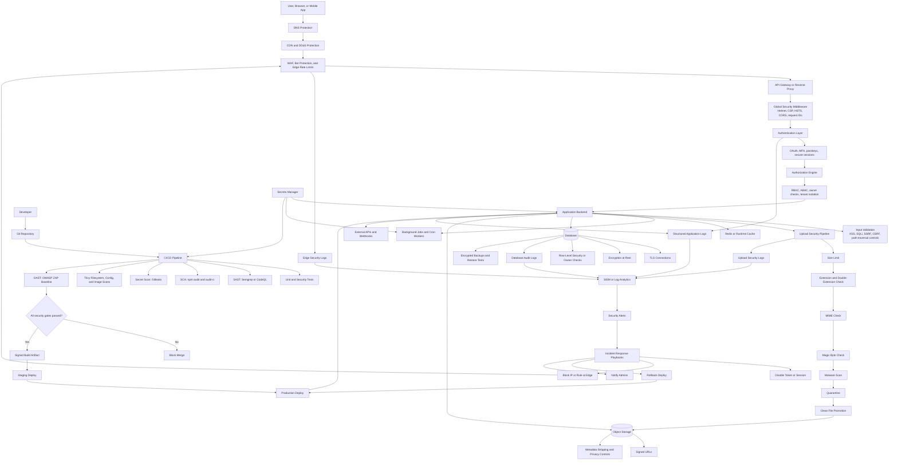
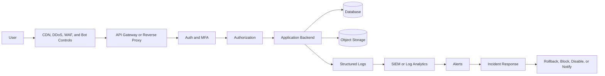
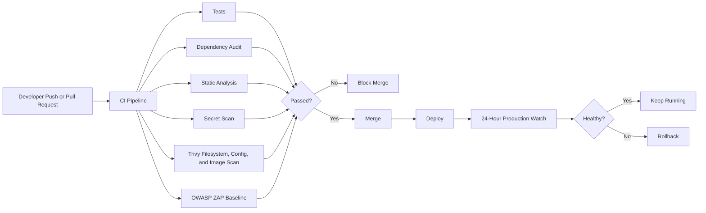
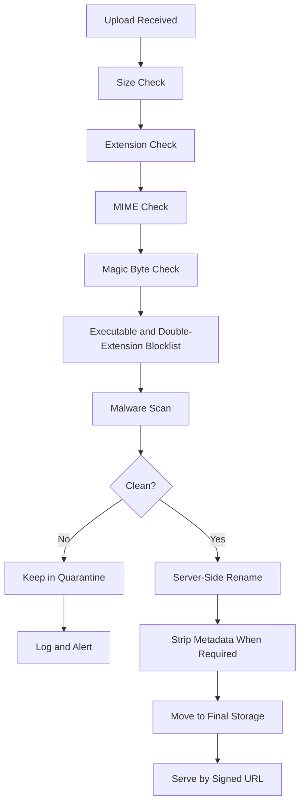
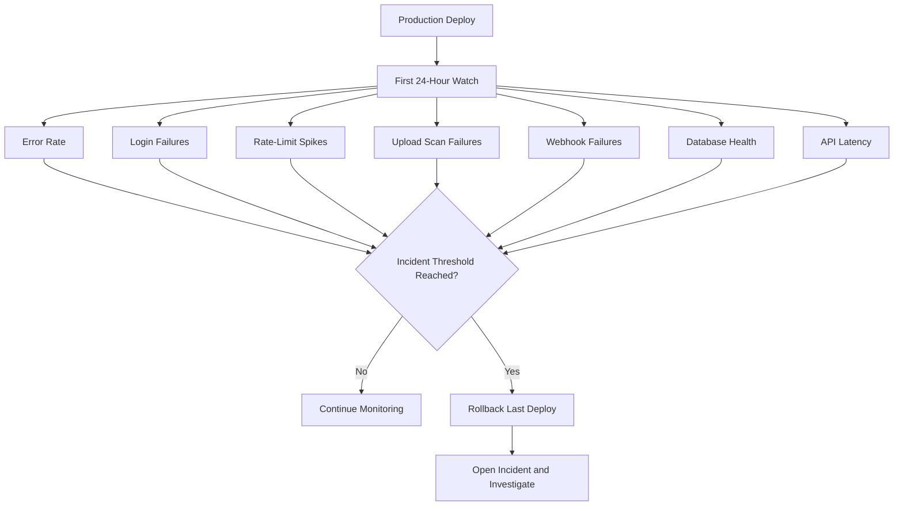

# Security Architecture

This is the target-state security architecture for the final hardening plan. It is a design map, not proof that every control is currently implemented.

## Proof Standard

Every security box must map to evidence before it is treated as production-ready:

| Layer | Prevent | Detect | Respond | Evidence |
|---|---|---|---|---|
| Edge | CDN, WAF, origin protection, rate limits | WAF and edge logs | Block rule or origin lockdown | Edge config, tests, alert record |
| Auth | MFA, passkeys/trusted device, session rotation | Auth telemetry and anomaly rules | Revoke session/token, lock account | Auth tests, logs, playbook |
| App | Headers, CORS, CSRF, validation, safe egress | Structured app logs | Hotfix branch, kill switch, rollback | Unit tests, CI reports |
| Upload | Type policy, magic bytes, malware scan | Upload security telemetry | Quarantine, block, alert | Upload tests, ClamAV/YARA reports |
| Data | TLS, encryption, tenant checks, backups | DB audit logs | Restore, revoke access, retention action | Restore drill, access review |
| Runtime | Non-root, read-only FS, resource limits | Falco/runtime detections | Restart, isolate, rollback | Runtime policy, alert evidence |
| Supply chain | SAST, SCA, secrets, SBOM, container scan | CI failure and artifact reports | Block merge, rotate secret, patch | Workflow run artifacts |

See [control-gap-tracker.md](./control-gap-tracker.md) for the current threat-to-evidence traceability map.

## End-to-End Security Architecture

## Simplified Runtime View

## CI/CD Security Gate

## Upload Security Flow

## Production Watch and Rollback

