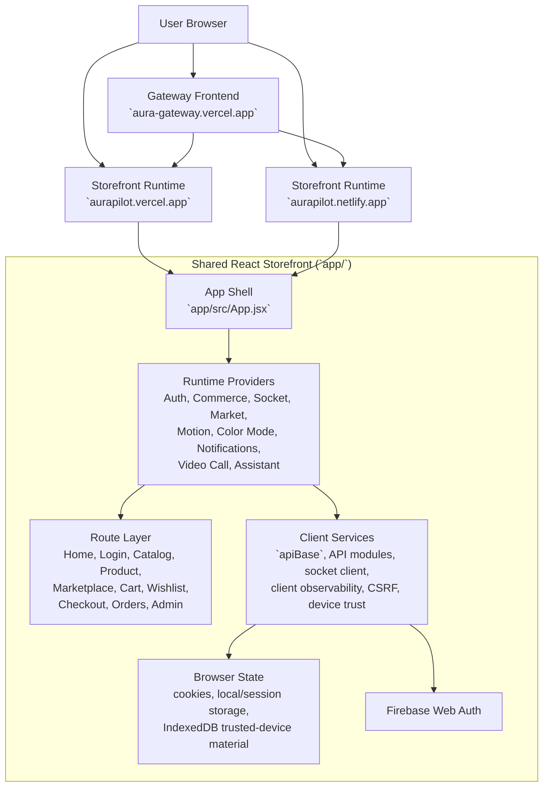
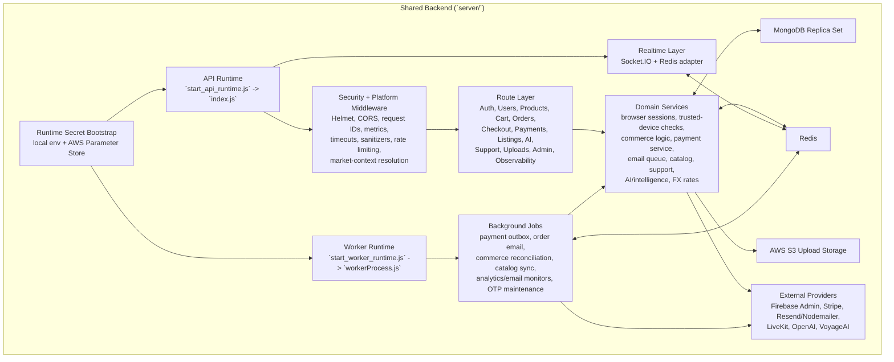
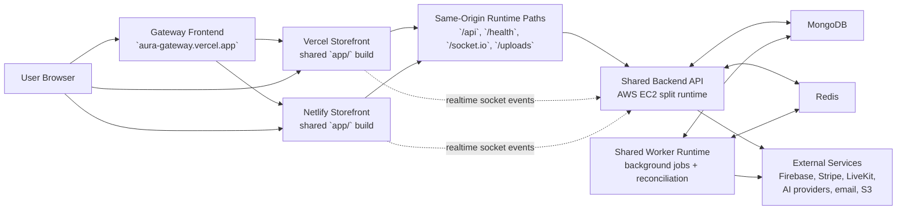

# System Architecture

This repo currently runs as three coordinated surfaces:
- a dedicated gateway frontend at `aura-gateway.vercel.app`
- the shared storefront frontend on both Vercel and Netlify
- a shared split-runtime backend that serves both storefront hosts

The diagrams below separate frontend and backend architecture, then connect them into one end-to-end view.

## Frontend Architecture

## Backend Architecture

## Connected System Flow

## Notes

- The gateway is a separate static Vercel project. It is not the storefront app itself.
- The Vercel and Netlify storefronts are two hosts for the same React/Vite frontend and are expected to behave identically.
- Both storefront hosts connect to the same backend runtime through proxied same-origin routes instead of talking to different backends.
- The backend is intentionally split into API and worker processes so traffic spikes on HTTP do not take down payment, email, reconciliation, or catalog jobs.
- Redis is part of both realtime coordination and distributed security/rate-limit behavior, not just caching.
