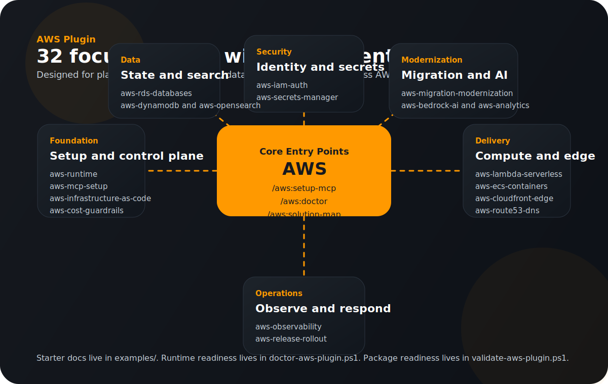

# AWS Plugin

This repo-local Codex AWS plugin is designed to feel useful in two different
ways:

- as a broad AWS platform toolkit for globally common cloud work
- as a repo-aware helper for this workspace's EC2, SSM, and rollout path

## Who It Is For

- builders shaping serverless apps, container platforms, data systems, and AI workloads
- platform teams reviewing IAM, networking, observability, deployment, and cost posture
- security teams checking secrets flow, public exposure, encryption, and abuse controls
- teams planning migration, modernization, or architecture cleanup across AWS services

## What It Includes

- a Codex plugin manifest at `.codex-plugin/plugin.json`
- support for a repo marketplace entry at `.agents/plugins/marketplace.json`
- 32 focused AWS skills under `skills/`
- guided solution starter playbooks under `examples/`
- a copy-paste prompt library for fast onboarding
- plugin command entry points under `commands/`
- an `.mcp.json` file wiring official AWS Knowledge, Documentation, and API MCP servers
- reusable PowerShell scripts under `scripts/` for bootstrap, diagnostics, validation, and safety policy generation
- a visual skill map and release changelog for package polish

## Start Here

If you want the fastest path to value, use one of these entry points first:

- `/aws:setup-mcp` to install or verify the local AWS MCP environment
- `/aws:doctor` to diagnose package, credential, or profile blockers
- `/aws:solution-map` to map a workload to the best AWS services and plugin skills
- `examples/README.md` if you want starter playbooks and copy-paste prompts

## First Run

Install the local AWS MCP Python packages:

```powershell
powershell -NoProfile -ExecutionPolicy Bypass -File .\plugins\aws\scripts\bootstrap-aws-mcp.ps1
```

Validate your AWS CLI credentials:

```powershell
powershell -NoProfile -ExecutionPolicy Bypass -File .\plugins\aws\scripts\bootstrap-aws-mcp.ps1 -VerifyAwsLogin
```

If that credential check fails, sign in first with one of:

```powershell
aws login
```

```powershell
aws configure sso
```

```powershell
aws configure
```

## Visual Skill Map



## Solution Starter Playbooks

- `examples/global-web-platform.md`: internet-facing app delivery with Route 53, CloudFront, WAF, ECS or Lambda, data stores, and guardrails
- `examples/secure-serverless-api.md`: API Gateway, Lambda, Cognito, DynamoDB, KMS, and Secrets Manager patterns
- `examples/data-lake-analytics.md`: S3, Glue, Athena, Kinesis, Redshift, and analytics platform planning
- `examples/incident-response.md`: production issue triage across CloudWatch, IAM, WAF, DNS, and runtime safety
- `examples/migration-modernization.md`: rehost, replatform, and modernization planning with cutover and rollback thinking
- `examples/prompt-library.md`: categorized copy-paste prompts for day-one AWS plugin use

## Built-In Skills

### Foundation And Platform Controls

- `aws-runtime`: broad repo-aware AWS reasoning and debugging
- `aws-mcp-setup`: install, verify, and troubleshoot the plugin itself
- `aws-infrastructure-as-code`: CloudFormation, CDK, Terraform, and IaC review workflow
- `aws-cost-guardrails`: monthly budget, SNS, scheduler, and shutdown guardrails
- `aws-observability`: CloudWatch-centric logs, metrics, alarms, and runtime troubleshooting
- `aws-release-rollout`: deploy-release flow, compose startup, and readiness checks

### Identity, Secrets, And Security

- `aws-iam-auth`: IAM, trust policy, STS, and access design
- `aws-github-oidc`: GitHub Actions deploy role and OIDC trust setup
- `aws-cognito`: user pools, identity pools, auth flows, tokens, and integration pitfalls
- `aws-parameter-store`: safe SSM Parameter Store planning, dry-runs, and syncs
- `aws-runtime-secrets`: render runtime env files from Parameter Store safely
- `aws-secrets-manager`: secret rotation, app integration, retrieval, and secret-lifecycle review
- `aws-kms`: key policies, grants, envelope encryption, and cross-service crypto posture
- `aws-security-review`: AWS security posture, least privilege, public exposure, and secrets handling
- `aws-waf-shield`: WAF rules, rate limiting, bot or abuse controls, and edge security posture

### Compute, Delivery, And Networking

- `aws-ec2-backend-deploy`: EC2 bootstrap, rollout, and repo-specific deployment guardrails
- `aws-lambda-serverless`: Lambda packaging, triggers, config, and operational patterns
- `aws-ecs-containers`: ECS, Fargate, ECR, service rollout, and container ops
- `aws-eks-kubernetes`: EKS clusters, node groups, ingress, IRSA, and Kubernetes-on-AWS operations
- `aws-api-gateway`: API Gateway routes, auth, integrations, stages, and request troubleshooting
- `aws-cloudfront-edge`: CloudFront, Route 53, ACM, caching, and edge delivery
- `aws-route53-dns`: hosted zones, records, health checks, failover, and DNS debugging
- `aws-vpc-networking`: VPC, subnets, security groups, routing, and connectivity debugging

### Data, State, Search, And Events

- `aws-s3-storage`: S3 buckets, lifecycle, uploads, signed URLs, and access posture
- `aws-rds-databases`: RDS and Aurora setup, backups, connectivity, and operations
- `aws-dynamodb`: table modeling, indexes, capacity, streams, access patterns, and hot partitions
- `aws-elasticache`: Redis and Memcached topology, auth, eviction, and app-cache debugging
- `aws-opensearch`: indexing, search clusters, access policy, ingestion, and query troubleshooting
- `aws-event-driven`: SQS, SNS, EventBridge, Step Functions, fan-out, retries, and async design
- `aws-analytics`: Athena, Glue, Redshift, Kinesis, and broader AWS analytics workflow design

### AI And Modernization

- `aws-bedrock-ai`: Bedrock models, inference patterns, guardrails, agents, and AI app integration
- `aws-migration-modernization`: cloud migration, cutover planning, modernization, and drift reduction

This gives the plugin 32 focused skills today. That is broad enough to cover
common AWS work without turning the skill surface into trigger spam.

## Built-In Commands

- `/aws:setup-mcp`
- `/aws:doctor`
- `/aws:ssm-sync`
- `/aws:deploy-check`
- `/aws:solution-map`
- `/aws:architecture-review`
- `/aws:security-review`
- `/aws:validate-plugin`

## Validation And Maintenance

Run the doctor script for a full runtime readiness report:

```powershell
powershell -NoProfile -ExecutionPolicy Bypass -File .\plugins\aws\scripts\doctor-aws-plugin.ps1
```

Run the package validator for static structure and release-facing coverage:

```powershell
powershell -NoProfile -ExecutionPolicy Bypass -File .\plugins\aws\scripts\validate-aws-plugin.ps1
```

Generate a cautious AWS API MCP security policy before enabling write access:

```powershell
powershell -NoProfile -ExecutionPolicy Bypass -File .\plugins\aws\scripts\write-aws-api-mcp-security-policy.ps1
```

## Notes

- The AWS Knowledge MCP server uses the official AWS-managed remote endpoint at `https://knowledge-mcp.global.api.aws`.
- The AWS API MCP server is configured in read-only mode by default for safety.
- The repo's default AWS region is set to `ap-south-1` in `.mcp.json` because that matches the current deployment docs in this workspace.
- The AWS API MCP server is configured to use the `aura-bootstrap` profile on this machine.
- The plugin keeps the AWS MCP Server (Preview) as a documented upgrade path, not the default, because AWS recommends avoiding overlapping old and new server setups that can create tool conflicts.
- The newer globally useful skills deliberately push service-specific detail lookup back through the AWS Knowledge and Documentation MCP servers so the plugin stays current without hardcoding stale service guidance.
- The examples and commands are intentionally opinionated starting points, not rigid architecture templates. They should accelerate good decisions, not hide tradeoffs.
